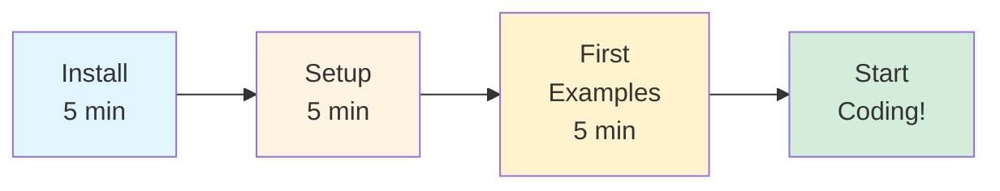
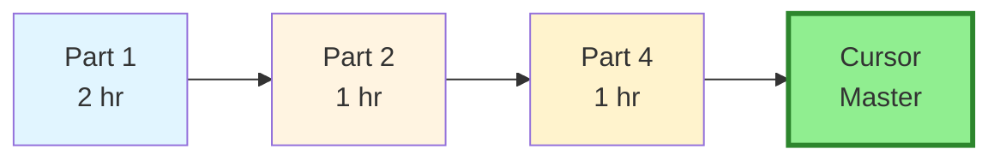
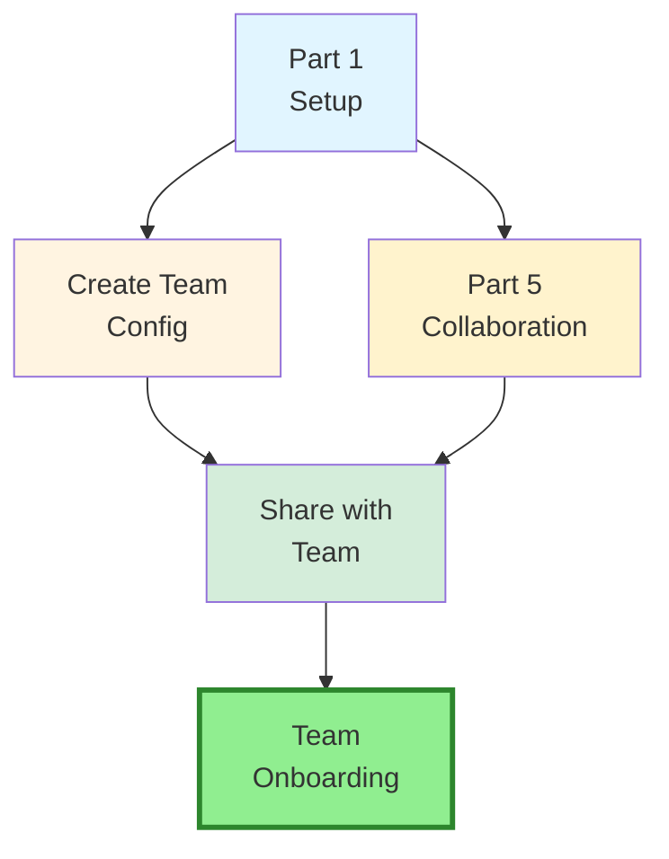

# Cursor IDE: Complete Technical Guide

**Master Cursor IDE for maximum productivity**  
**Target Audience:** Senior developers, tech leads, engineering teams  
**Maintainer**: Viachaslau Kudzinau 
(viachaslau_kudzinau@epam.com)  
**Last Updated:** January 2026

---

## 🎯 What You'll Master

This comprehensive guide teaches you to leverage **Cursor IDE** for:

- ✅ **Tab autocomplete** - Fast, predictive code completion (320ms)
- ✅ **Inline Edit (Cmd+K)** - Surgical, focused changes
- ✅ **Composer/Agent (Cmd+I)** - Multi-file orchestration
- ✅ **Debug Mode** - Hypothesis-driven debugging
- ✅ **Parallel Agents** - Explore multiple solutions simultaneously
- ✅ **Visual Editor** - Real-time UI styling and design
- ✅ **MCP Integration** - Connect to external systems (Slack, GitHub, databases)
- ✅ **Context7** - Live, version-specific library documentation
- ✅ **Multiple AI models** - Claude 4.5, GPT-5, Gemini 3, Cursor Composer
- ✅ **Enterprise patterns** - Team collaboration and deployment

---

## 🚀 Get Your First Win in 5 Minutes

### 1. Auto-Complete with Tab
```typescript
// Just start typing and press Tab
function calculateMonthlyPayment(principal, rate, years) {
  // Tab suggests the entire implementation
}
```

### 2. Inline Edit with Cmd+K
```
Select a function
Press Cmd+K (Windows: Ctrl+K)
"Refactor this function to use async/await and add error handling"
```

### 3. Multi-File Feature with Composer
```
Press Cmd+I (Windows: Ctrl+I)
"@codebase Add authentication to the entire application"
```

### 4. Debug with Debug Mode
```
"This function returns undefined intermittently. Debug and fix it."
Agent instruments code, analyzes logs, proposes fix
```

---

## 📚 Guide Structure

### [Part 1: Fundamentals & Core Concepts](docs/01-fundamentals-core-concepts/)

Build essential mental models and understand Cursor's architecture.

#### ✅ [Section 1: Mental Models & Architecture](docs/01-fundamentals-core-concepts/01-mental-models-architecture.md)
**Status:** Complete ✅  
Learn how Cursor thinks: Tab vs Inline Edit vs Composer vs Agent, AI model selection, context windows, rules architecture, and MCP integration.

**Key concepts:**
- Tool selection matrix (Tab, Cmd+K, Cmd+I, Debug Mode, Parallel Agents)
- 8 AI models and when to use each
- Context windows and codebase indexing
- Rules architecture (Project Rules, AGENTS.md, Team Rules)
- Model Context Protocol (MCP) and Context7

**Time:** 45 minutes

---

#### ✅ [Section 2: Environment & Project Setup](docs/01-fundamentals-core-concepts/02-environment-project-setup.md)
**Status:** Complete ✅  
Install Cursor, configure workspace, create `instructions.md`, set up rules, and optimize for your project size.

**Key topics:**
- Installation and subscription tiers
- Codebase indexing strategies (small repos vs monorepos)
- `instructions.md` pattern (single source of truth)
- Project Rules (`.cursor/rules/`) or AGENTS.md setup
- `.cursorignore` configuration
- Commands feature for reusable prompts
- Monorepo best practices

**Time:** 30-45 minutes

---

#### ✅ [Section 3: Core Workflows](docs/01-fundamentals-core-concepts/03-core-workflows.md)
**Status:** Complete ✅  
Master essential daily development workflows with Cursor.

**Key workflows:**
- TDD pattern (test-first with Agent)
- Refactoring pattern (multi-step, incremental)
- Debug Mode workflow (hypothesis-driven)
- Parallel agents (exploring multiple approaches)
- Infrastructure-as-Code (Terraform, CDK)
- Progressive enhancement pattern

**Time:** 45 minutes

---

### [Part 2: Advanced Features & Visual Development](docs/02-advanced-features-visual-dev/)

**Status:** Complete ✅

Complex workflows and visual development patterns.

- Advanced recipes (API migrations, database migrations, large-scale refactors)
- Visual development (screenshot-to-code, Visual Editor, comparative debugging)

---

### [Part 3: DevOps & Backend Architecture](docs/03-devops-backend-architecture/)

**Status:** Complete ✅

Infrastructure and backend patterns.

- DevOps & Infrastructure (Kubernetes with MCP, Terraform, Docker, CI/CD)
- Backend architecture patterns (microservices, event sourcing, CQRS, API gateway)

---

### [Part 4: Context Management & Prompting](docs/04-context-management-prompting/)

**Status:** Complete ✅

Mastering context and advanced prompts.

- Context management (context-first approach, focused context, conversation hygiene)
- Advanced prompting strategies (chain-of-thought, multi-tool orchestration, model ensemble)

---

### [Part 5: Team Collaboration & Domain Patterns](docs/05-team-collaboration-domain/)

**Status:** Complete ✅

Teamwork and specialized workflows.

- Team collaboration (shared rules, team notepads, pair programming, PR reviews)
- Domain-specific patterns (Kubernetes, data pipelines, ML training)
- Runbooks & guardrails (project rules templates, YOLO mode guardrails)

---

### [Part 6: Troubleshooting & Reference](docs/06-troubleshooting-reference/)

**Status:** Complete ✅

Complete reference guide and solutions.

- Failure modes & anti-patterns
- Reference prompts & templates
- Productivity benchmarks
- Troubleshooting guide
- Future-proofing strategies

---

## 🗺️ Learning Paths

### Path 1: "First Win in 15 Minutes" ⚡

**Goal:** Get productive immediately



**Steps:**
1. Install Cursor IDE (5 min)
2. Create `instructions.md` and `.cursor/rules/` or `AGENTS.md` (5 min)
3. Try Tab, Cmd+K, and Cmd+I (5 min)
4. Start using in your work

**When to come back:** After a few hours, complete Part 1 for deeper understanding.

---

### Path 2: "Master Cursor in 4 Hours" 🎓

**Goal:** Comprehensive mastery



**Steps:**
1. **Part 1:** Fundamentals & Core Concepts (2 hours)
2. **Part 2:** Advanced Features & Visual Dev (1 hour)
3. **Part 4:** Context Management & Prompting (1 hour)
4. Practice with real projects

**Outcome:** Confident use of all Cursor features, 30-40% velocity improvement.

---

### Path 3: "Enable Your Team in 2 Hours" 👥

**Goal:** Team adoption and consistency



**Focus areas:**
1. **Part 1, Section 2:** Environment & Project Setup
   - Create shared `instructions.md`
   - Set up `.cursor/rules/` for team
   - Configure `.cursorignore`
2. **Part 5:** Team Collaboration
   - Shared rules repository
   - Team notepads
   - Commands for common tasks
3. **Team enablement:**
   - Commit configurations to git
   - Schedule training session
   - Track velocity metrics

**Outcome:** Team consistency, faster onboarding, shared best practices.

---

## 💡 Productivity Patterns

### Tool Selection Matrix

| Task Type | Use This | Why |
|-----------|----------|-----|
| Boilerplate, imports | **Tab** | Fastest (320ms), predictive |
| Single-line fix | **Inline Edit (Cmd+K)** | Surgical, shows diff |
| Refactor function | **Inline Edit (Cmd+K)** | Focused scope, fast |
| Multi-file feature | **Composer (Cmd+I)** | Multi-file orchestration |
| Visual UI work | **Visual Editor** | Real-time styling |
| Complex architecture | **Agent Mode** | Autonomous, cross-cutting |
| Elusive bugs | **Debug Mode** | Hypothesis-driven debugging |
| Exploring approaches | **Parallel Agents** | Best-of-N solutions |

### Model Selection Guide

| Phase | Model | Why |
|-------|-------|-----|
| **Planning/Analysis** | Claude 4.5 Sonnet | Deep reasoning, complex instructions |
| **Execution** | Cursor Composer 1 | 4x faster, optimized for coding |
| **Review** | Gemini 3 Pro | 1M token context, full codebase review |
| **Speed over accuracy** | GPT-5.2 | Fast boilerplate generation |

### Context @ Mention Strategy

| Scope | Syntax | Use Case |
|-------|--------|----------|
| **Single file** | `@src/auth.ts` | Focused edits |
| **Folder** | `@src/components/` | Cross-component refactors |
| **Codebase** | `@codebase` | Discovering patterns |
| **Docs** | `@react-docs.org` | Static documentation |
| **Web** | `@web` | Latest news/updates |
| **Context7** | Auto-invoked | Version-specific library docs |
| **Instructions** | `@instructions.md` | Project context |

---

## 💰 Pricing & ROI

### Subscription Tiers

- **Free Tier**: Limited requests, basic features
- **Pro Tier** ($20/month): Unlimited requests, all models, priority support
- **Business Tier**: Team features, admin controls
- **Enterprise Tier**: Custom deployment, SSO, compliance

### ROI Examples

| Metric | Improvement | Source |
|--------|-------------|---------|
| **PRs merged** | +39% | University of Chicago (2025) |
| **Time-to-PR** | -26% | University of Chicago (2025) |
| **Onboarding time** | -40% | Fortune 500 companies |
| **Boilerplate code** | 5-10x faster | Real-world measurements |
| **Refactoring** | 3-5x faster | Real-world measurements |
| **Debugging** | 2-3x faster | With Debug Mode |
| **Documentation** | 10x faster | README, API docs |

**Break-even:** Most teams see ROI within 2-4 weeks.

---

## ⌨️ Essential Keyboard Shortcuts

### Core Features

| Action | Windows/Linux | macOS |
|--------|---------------|-------|
| Tab autocomplete | `Tab` | `Tab` |
| Inline Edit | `Ctrl+K` | `Cmd+K` |
| Composer/Agent | `Ctrl+I` | `Cmd+I` |
| Chat | `Ctrl+L` | `Cmd+L` |
| New chat | `Ctrl+Shift+L` | `Cmd+Shift+L` |

### Agent Controls

| Action | Windows/Linux | macOS |
|--------|---------------|-------|
| Command palette | `Ctrl+Shift+P` | `Cmd+Shift+P` |
| Commands menu | Type `/` | Type `/` |
| Mention context | Type `@` | Type `@` |
| Submit prompt | `Ctrl+Enter` | `Cmd+Enter` |
| Cancel agent | `Esc` | `Esc` |

### Navigation

| Action | Windows/Linux | macOS |
|--------|---------------|-------|
| Quick file open | `Ctrl+P` | `Cmd+P` |
| Symbol search | `Ctrl+T` | `Cmd+T` |
| Find in file | `Ctrl+F` | `Cmd+F` |
| Find in project | `Ctrl+Shift+F` | `Cmd+Shift+F` |

---

## ❓ FAQ

### Q: How is Cursor different from GitHub Copilot?

**A:** Cursor is a full IDE (based on VS Code) with integrated AI, while Copilot is an extension. Key differences:
- **Speed:** Cursor Tab is 3x faster (320ms vs 890ms)
- **Multi-file:** Composer can edit multiple files simultaneously
- **Context:** Better codebase indexing and context management
- **Models:** Access to Claude 4.5, GPT-5, Gemini 3, and Cursor's own Composer model
- **Features:** Debug Mode, Parallel Agents, Visual Editor, MCP integration

### Q: Does Cursor store my code?

**A:** No. Code never leaves your machine. Only embeddings (for codebase indexing) are stored server-side, encrypted and obfuscated. Privacy Mode keeps everything local.

### Q: Can I use Cursor with my existing VS Code setup?

**A:** Yes. Cursor is built on VS Code and supports all VS Code extensions, settings, and keybindings. You can import your VS Code configuration.

### Q: What's the learning curve?

**A:** Basic productivity in 15 minutes. Mastery in 4 hours. Most developers see immediate value with Tab and Inline Edit.

### Q: How does pricing work?

**A:** Pro tier ($20/month) includes unlimited requests to all models. Free tier has limited requests. Enterprise tier available for teams.

### Q: Can I use Cursor offline?

**A:** Tab autocomplete works offline (cached model). Composer, Agent, and Chat require internet connection for AI models.

### Q: What languages does Cursor support?

**A:** All languages supported by VS Code. AI features work best with popular languages (TypeScript, Python, Go, Rust, Java, etc.).

### Q: How do I get started?

**A:** Download from [cursor.com](https://cursor.com), install, and follow [Part 1: Fundamentals](docs/01-fundamentals-core-concepts/) for setup.

---

## 🎯 Quick Start Checklist

### Week 1: Basics
- [ ] Install Cursor IDE
- [ ] Create `instructions.md` for your project
- [ ] Set up Project Rules in `.cursor/rules/` OR create `AGENTS.md`
- [ ] Configure `.cursorignore`
- [ ] Master Tab, Cmd+K, Cmd+I basics
- [ ] Write first 5 prompts with good context

**Checkpoint:** Can complete simple tasks 2-3x faster

### Week 2-3: Intermediate
- [ ] Use Composer for multi-file refactors
- [ ] Implement TDD pattern with Agent
- [ ] Set up YOLO mode for automation
- [ ] Create first custom command
- [ ] Use Debug Mode successfully

**Checkpoint:** Handle complex tasks independently

### Week 4+: Advanced
- [ ] Run parallel agents
- [ ] Use MCP for live infrastructure access
- [ ] Implement team notepads
- [ ] Create shared rules repository
- [ ] Train team members

**Checkpoint:** 30-40% velocity improvement, team adoption

---

## 📖 Additional Resources

### Official Documentation
- **Cursor Website**: [cursor.com](https://cursor.com)
- **Cursor Docs**: [cursor.com/docs](https://cursor.com/docs)
- **Cursor Changelog**: [cursor.com/changelog](https://cursor.com/changelog)

### Community
- **Cursor Forum**: [forum.cursor.com](https://forum.cursor.com)
- **Cursor Discord**: [cursor.com/discord](https://cursor.com/discord)

### This Guide
- **Version**: 2.0 (January 2026)
- **Maintainer**: Viachaslau Kudzinau
- **Email**: viachaslau_kudzinau@epam.com
- **Feedback**: Open issues or contact maintainer

---

## 🚀 Current Status

### ✅ Completed Sections

All 6 parts and 17+ sections complete:
- Part 1: Fundamentals & Core Concepts (3 sections)
- Part 2: Advanced Features & Visual Development (2 sections)
- Part 3: DevOps & Backend Architecture (2 sections)
- Part 4: Context Management & Prompting (2 sections)
- Part 5: Team Collaboration & Domain Patterns (3 sections)
- Part 6: Troubleshooting & Reference (5 sections)

### 📊 Guide Statistics

- **Total sections:** 17+
- **Estimated reading time:** 10-12 hours
- **Quick start time:** 15 minutes
- **Master path time:** 4 hours
- **Team enablement time:** 2 hours

---

## 📝 Version History

**v2.0 (January 2026) - Major Restructure:**
- Complete restructure into directory-based organization (matching copilot-guide style)
- Updated with latest official Cursor documentation
- Added Claude 4.5 Opus, GPT-5.2, Gemini 3 Pro, Grok Code models
- Aligned terminology with official docs (Tab, Inline Edit, Agent, Composer)
- Added comprehensive learning paths
- Enhanced quick reference tables
- Added FAQ section
- Updated keyboard shortcuts
- Improved navigation and structure

**v1.0 (December 2025):**
- Initial release with 6 parts
- Comprehensive Cursor IDE coverage

---

*This is a living document that evolves with Cursor. Bookmark, share, and contribute to keep it up-to-date!*

**Start your journey:** [Part 1: Fundamentals & Core Concepts →](docs/01-fundamentals-core-concepts/)
