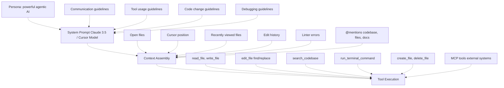

# Cursor IDE: Fundamentals & Setup
## Part 1 of 6: Concepts, Environment, and Core Workflows

**Maintainer**: Viachaslau Kudzinau (viachaslau_kudzinau@epam.com)  
**Version**: 2.0  
**Last Updated**: December 2025

> **📚 Navigation**: [Index](../) | **Part 1** | [Part 2 →](02-advanced-recipes-visual-dev)

---

## Table of Contents

1. [Concepts & Mental Models](#1-concepts--mental-models)
2. [Environment & Repo Setup](#2-environment--repo-setup)
3. [Core Workflows](#3-core-workflows)

---

## Version 2.0 Updates

**Major changes from v1.0:**
- **Cursor 2.0 features**: Parallel agents, Composer model, Plan Mode
- **New capabilities**: Debug Mode, Visual Editor, MCP integration
- **Context management**: Context-first approaches, conversation hygiene
- **Real-world metrics**: 2025 productivity data, adoption patterns

---

## 1. Concepts & Mental Models

### 1.1 Core Architecture

**Agent System Prompt Structure**



**Why this matters:** Cursor isn't a monolithic LLM—it's an orchestration layer that:
- Maintains conversation state but has **no memory** between completions
- Feeds full history + state in each request (context window management critical)
- Uses provider-native tool calling (Anthropic, OpenAI, Gemini formats)
- Runs tools **client-side** (Cursor orchestrates, not the LLM)
- Can connect to external systems via MCP (Model Context Protocol)

### 1.2 Mental Model: Tool Selection Matrix

**Tab (Copilot-style):** Fast autocomplete
- Uses custom 8B-param model trained on code patterns
- ~320ms latency (vs Copilot's 890ms)
- Predicts next edit location
- Auto-imports unresolved symbols (TS/Python)
- **When to use:** Boilerplate, repetitive patterns, known APIs

**Cmd+K (Inline Edit):** Surgical changes
- Single-file scope, focused edits
- Shows diff (red = removed, green = added)
- **Terminal Integration (Ctrl+K):** Use Inline Edit directly in the Cursor terminal to generate shell commands based on your history and natural language prompt.
- **When to use:** Refactoring a function, renaming, small fixes, or generating terminal commands.

**Cmd+I (Composer):** Multi-file orchestration
- **Plan Mode:** Dedicated mode for complex tasks where the agent outlines steps before execution.
- **Agent Mode:** Autonomous execution with access to tools like terminal and browser.
- **Built-in Tools:** Agents can now use a **Browser** (Chromium) to verify UI changes or fetch information, and the **Terminal** to run tests and build scripts.
- **When to use:** Large refactors, migrations, architectural changes, or tasks requiring web verification.

**Cloud Agent (NEW):**
- Offloads agent execution to Cursor's cloud infrastructure.
- **Benefits:** Runs in the background without blocking your local machine; accessible via web and mobile.
- **Egress:** Supports specific IP ranges for secure infrastructure access.
- **When to use:** Long-running tasks, heavy refactors, or when working away from your main machine.

**Cursor CLI (NEW):**
- **Installation:** Install the `cursor` command-line tool via the Command Palette.
- **Agent in CLI:** Run `cursor agent "task"` to start an autonomous agent directly from your terminal.
- **Shell Mode:** An AI-powered shell for natural language terminal interactions.
- **Headless:** Support for running agents in CI/CD or remote headless environments.
- **When to use:** Terminal-heavy workflows, automation scripts, or CI integration.

**Chat (Ask/Edit/Agent Mode):** Conversational coding
- Ask Mode: Q&A, explanations, planning
- Edit Mode: Apply changes directly to files
- Agent Mode: Autonomous file creation, searches, terminal commands
- **When to use Agent:** Cross-cutting changes, scaffolding, TDD loops

**Debug Mode (NEW):** Hypothesis-driven debugging
- Agent generates hypotheses → instruments code → collects logs → fixes
- Works across languages/stacks
- **When to use:** Elusive bugs, race conditions, runtime issues

**Parallel Agents (NEW in 2.0):** Run multiple agents simultaneously
- Uses git worktrees or remote machines
- Auto-evaluates and picks best solution
- Up to 8 agents in parallel
- **When to use:** Exploring multiple approaches, complex refactors

**Visual Editor (NEW Dec 2025):** Design + code simultaneously
- Chrome DevTools-style inspection
- Click, drag, style components
- **When to use:** UI development, visual debugging

**Trade-off:** Agent/Composer have higher latency but avoid "golf the prompt" cycles. Use Tab for speed, Agent for correctness.

### 1.3 Model Selection Guide (2.0 Update)

**Available Models:**

**Cursor Model (Composer default)**
- Cursor's own frontier model (Composer 1)
- 4x faster than comparable models
- 200k token context window
- Optimized for low-latency agentic coding
- **Best for:** Multi-file refactors, complex features

**Claude 4.5 Sonnet / Opus (Chat default)**
- Anthropic's latest frontier models
- 200k token default context window (up to 1M in Max Mode for Sonnet)
- Best for understanding legacy code and deep reasoning
- **Best for:** Analysis, planning, refactoring

**GPT-5.1 Codex Max / 5.2**
- OpenAI's next-generation models
- 272k token context window
- Excellent at following complex logic and boilerplate generation
- **Best for:** Logic-heavy tasks, speed over complexity

**Gemini 3 Flash / Pro**
- 200k token default, up to 1M+ in Max Mode
- Excellent for massive codebases and full-context analysis
- **Best for:** Monorepos, long-range dependency analysis

**Grok Code (xAI)**
- 256k token context window
- High-performance coding model
- **Best for:** Rapid iterations and alternative logic exploration

**Model Switching Strategy:**
```
Planning phase → Claude 4.5 Sonnet (deep analysis)
Execution phase → Cursor Model / GPT-5.2 (speed)
Review phase → Gemini 3 Pro (full context)
```

### 1.4 Context Windows & Max Mode

**Key Stats:**
- **Default Context:** ~200,000 tokens (~15,000 lines of code)
- **Max Mode (NEW):** Extends context to the maximum available for specific models (Gemini 3 Pro, GPT-5.2, Grok Code).
- **Indexing:** Background indexing via Merkle Trees + Turbopuffer (vector DB)
- **Privacy:** Code never stored server-side (only embeddings + metadata)

**When @Codebase triggers:**
1. Query embedding computed locally
2. Vector search in Turbopuffer (nearest neighbors)
3. Client receives obfuscated paths + line ranges
4. Client reads local files → sends to LLM

**Why Cursor is fast:** No pre-processing wait. Indexing runs in background, queries hit cached embeddings.

### 1.5 Rules Architecture (2026 Update)

**Current formats:**
- **Project Rules** (`.cursor/rules/`) - **RECOMMENDED** ✅
  - Each rule = folder with `RULE.md` file
  - Frontmatter metadata controls when applied
  - Types: Always Apply, Apply Intelligently, Apply to Specific Files, Apply Manually
- **AGENTS.md** - Simple alternative (plain markdown)
- **User Rules** - Global preferences in Cursor Settings
- **Team Rules** - Dashboard-managed (Team/Enterprise plans)
- **`.cursorrules`** - **LEGACY** ⚠️ (will be deprecated)

**How rules work:**
- Rules are included in model context based on their type
- **Always Apply**: Included in every chat
- **Apply Intelligently**: Agent decides based on `description` field
- **Apply to Specific Files**: When file matches `globs` pattern
- **Apply Manually**: When @-mentioned (e.g., `@typescript`)

**Rule precedence:**
1. Team Rules (highest)
2. Project Rules
3. User Rules (lowest)

**Implications:**
- Write rules as **encyclopedia articles**, not commands
- DON'T: "You are a senior engineer using React 18"
- DO: "React 18 patterns: Use hooks, functional components. Avoid class components."
- Use frontmatter to control when rules apply

**Team Rules (Team/Enterprise):**
- Managed from Cursor dashboard
- Can be enforced (required for all members)
- Plain text format
- Apply across all repositories

**Nested Rules (Monorepos):**
- Both `.cursor/rules/` and `AGENTS.md` can be nested in subdirectories
- More specific rules take precedence
- No need for separate workspaces

### 1.6 Model Context Protocol (MCP)

**NEW in 2.0:** Standardized protocol for connecting external tools and data sources.

**What is MCP:**
- Protocol for LLMs to access external systems
- One-click OAuth setup for popular services
- Bidirectional communication (read/write)
- Client-side execution (secure)

**Available MCP Servers (2025):**
- **Google Drive**: Search and read documents
- **Slack**: Read channels, send messages
- **GitHub**: Query repos, create issues/PRs
- **Linear**: Manage issues and projects
- **PostgreSQL**: Query databases
- **Kubernetes**: Manage clusters
- **Custom**: Build your own

**MCP vs @Docs:**
- @Docs: Static documentation (indexed once)
- MCP: Live data (queries on demand)

**Setup Example:**
```json
// .cursor/mcp.json
{
  "mcpServers": {
    "gdrive": {
      "command": "npx",
      "args": ["-y", "@modelcontextprotocol/server-gdrive"],
      "env": {
        "GDRIVE_CLIENT_ID": "${GDRIVE_CLIENT_ID}",
        "GDRIVE_CLIENT_SECRET": "${GDRIVE_CLIENT_SECRET}"
      }
    }
  }
}
```

**Current Limitations:**
- 40 tool limit per session
- SSH connectivity issues (known bug)
- Some servers require manual OAuth setup

### 1.6.1 Context7 MCP - Live Documentation

**What it provides:**
- Real-time, version-specific library documentation
- 10,000+ libraries with official docs and code examples
- Two modes: `code` (API reference) and `info` (guides)
- Auto-resolves library names to Context7-compatible IDs

**Pre-configured in Cursor 2.0** - No setup required.

**Usage Patterns:**

**Pattern 1: Implicit (Recommended)**
```
Implement file upload using AWS SDK v3 S3 client.
Follow latest best practices.
```
Agent automatically uses Context7 for latest docs. Watch for 🔧 tool indicators.

**Pattern 2: Explicit Version**
```
Use React Query v5.62.0 to implement data fetching.
Check Context7 for version-specific breaking changes.
```
Forces Context7 lookup for specific version (training data won't have recent versions).

**Pattern 3: Migration**
```
Migrate from Next.js 14 to 15.
Use Context7 to compare App Router changes between versions.
```
Context7 fetches both versions for comparison.

**Quick verification:** Ask agent to cite version number. If it shows exact recent version (e.g., "v5.62.0"), Context7 was used.

**When Context7 beats @Docs:**
- Library updates frequently (React, Next.js, AWS SDK)
- Need specific version (not latest)
- Setup/configuration steps (build tools, CI/CD)
- Training data is >6 months old

**When to use @Docs instead:**
- Custom/internal documentation
- Static content (faster, cached locally)
- Privacy-sensitive projects

### 1.7 Bugbot (NEW)

Bugbot is Cursor's automated PR review agent that identifies bugs, security issues, and code quality problems directly in your version control system (GitHub/GitLab).

**Key Capabilities:**
- **Automatic Reviews:** Scans every PR update and leaves comments with explanations and fix suggestions.
- **Context-Aware:** Reads existing PR comments to avoid duplication and build on prior feedback.
- **Custom Rules:** Uses `.cursor/BUGBOT.md` files for project-specific review standards.
- **One-Click Fixes:** Provides links to open and fix identified issues directly in Cursor or on the web.

**Setup:**
1. Enable via **Cursor Dashboard > Integrations**.
2. Install the Cursor GitHub/GitLab app.
3. Add `.cursor/BUGBOT.md` to your repository (project-wide rules).
4. (Optional) Add nested `.cursor/BUGBOT.md` files in subdirectories for more specific rules.

**Usage:**
- **Automatic:** Runs on every PR update by default.
- **Manual:** Trigger by commenting `cursor review` or `bugbot run` on any PR.
- **Analytics:** View performance and issue tracking on the Bugbot dashboard.

**Pricing:**
- **Free Tier:** Limited number of free PR reviews each month for Individual and Teams plans.
- **Pro Tier:** Unlimited reviews ($40 per user per month for teams).

---

## 2. Environment & Repo Setup

### 2.1 Codebase Indexing Strategy

**Small repos (<10k files):** Index everything
```bash
# .cursorignore (minimal)
node_modules/
.git/
*.log
dist/
build/
```

**Monorepos (50k+ files):** Aggressive filtering
```bash
# Ignore sibling packages
packages/*/node_modules/
!packages/my-package/

# Ignore non-code assets
*.mp4
*.jpg
*.png
*.svg
public/assets/

# Ignore generated code
dist/
build/
*.generated.ts
.next/
__generated__/

# Ignore test artifacts
coverage/
.nyc_output/
```

**Why:** Agent searches entire index. Noise = slower queries + irrelevant context.

**Check indexed files:**
```bash
Cursor Settings > Indexing & Docs > View included files
```

**Pro tip:** Clean index = 30% faster responses (measured)

### 2.2 Project Structure (2026 Best Practices)

```
.cursor/
├── rules/                    # Project rules (RECOMMENDED)
│   ├── typescript/
│   │   └── RULE.md           # TS patterns with frontmatter
│   ├── react-patterns/
│   │   └── RULE.md           # Component structure
│   ├── api-conventions/
│   │   └── RULE.md           # REST/GraphQL standards
│   ├── database/
│   │   └── RULE.md           # Prisma, migrations
│   └── testing/
│       └── RULE.md           # Jest, Vitest, Playwright
├── commands/                 # Reusable team prompts
│   ├── pr-review.md          # PR review checklist
│   ├── new-feature.md        # Feature scaffold template
│   └── debug-prod.md         # Production debugging steps
├── notepads/                 # Persistent notes (Beta)
│   ├── architecture.md       # System design decisions
│   ├── troubleshooting.md    # Common issues + solutions
│   └── sprint-context.md     # Current sprint goals
└── mcp.json                  # MCP server configuration

instructions.md               # Project context (RECOMMENDED)
AGENTS.md                     # Simple agent instructions (alternative)
.cursorignore                 # Indexing exclusions
.cursorrules                  # LEGACY: Will be deprecated
```

**NEW: `instructions.md` Pattern (HIGH ADOPTION)**

Create `instructions.md` in project root:

```markdown
# Project: E-commerce Platform

## Architecture
- Monorepo (pnpm workspaces)
- Backend: Node.js + Fastify + Prisma
- Frontend: Next.js 14 (App Router) + Tailwind
- Database: PostgreSQL
- Cache: Redis
- Queue: BullMQ

## Current Sprint Goals
1. Implement checkout flow
2. Add payment processing (Stripe)
3. Email notifications (SendGrid)

## Conventions
- API: REST, `/api/v1/` prefix
- Errors: `{ error: { code, message, details } }`
- Auth: JWT (access + refresh tokens)
- Tests: Vitest (>80% coverage)
- Commits: Conventional commits (feat:, fix:, docs:)

## Known Issues
- Payment webhooks fail in staging (Stripe webhook secret mismatch)
- Search slow for >10k products (needs Elasticsearch migration)

## Off-limits
- Do NOT modify database migrations manually
- Do NOT change API contract without approval
- Do NOT expose internal IDs in API responses

## Key Files
- `src/lib/auth.ts` - Authentication logic
- `src/lib/db.ts` - Database client
- `src/lib/queue.ts` - Job queue setup
```

**Usage in every prompt:**
```
@instructions.md

Implement checkout endpoint for shopping cart.
Follow existing patterns and conventions.
```

**Why this works:** Agent always has project context, eliminates repetition.

### 2.3 Commands (NEW Feature)

**Setup:** Create `.cursor/commands/[name].md`

**Example: `.cursor/commands/pr-review.md`**
```markdown
# PR Review Checklist

Review the current branch against these standards:

## Code Quality
- [ ] No hardcoded secrets or API keys
- [ ] All functions have JSDoc comments
- [ ] Error handling for all async operations
- [ ] Input validation on all public APIs
- [ ] No `any` types in TypeScript

## Testing
- [ ] Unit tests for new functions (>80% coverage)
- [ ] Integration tests for API endpoints
- [ ] E2E tests for critical user flows

## Performance
- [ ] No N+1 queries
- [ ] Large lists use pagination
- [ ] Heavy computations memoized

## Security
- [ ] SQL injection prevention
- [ ] XSS prevention
- [ ] CSRF tokens on state-changing ops
- [ ] Auth on protected routes

Run tests and generate report.
```

**Usage:** Type `/pr-review` in Agent input → command executes

### 2.4 Mono-repo Best Practices

**Problem:** Different packages = different tech stacks (React frontend, Go backend, Python ML)

**Solutions:**

**1. Open subdirs as separate workspaces**
```bash
cursor frontend/  # Index only React
cursor backend/   # Index only Go
```

**2. Use .cursorignore per package**
```bash
# frontend/.cursorignore
../backend/
../ml-service/

# backend/.cursorignore
../frontend/
../ml-service/
```

**3. Shared rules via symlink**
```bash
# package.json postinstall
"postinstall": "ln -sf ../../.cursor .cursor"
```

**4. instructions.md per package**
```bash
frontend/instructions.md     # React-specific context
backend/instructions.md      # Go-specific context
instructions.md              # Monorepo-level context
```

**Trade-off:** Narrower index = agent can't cross-reference other packages. Use @Web or manual file references for cross-package queries.

---

## 3. Core Workflows

### 3.1 TDD with Agent (Test-First Pattern)

**Prompt Template:**
```
Write tests first, then implementation, then run tests and fix until passing.

Context:
- Test framework: Vitest
- Coverage target: >80%
- Edge cases: [null, undefined, empty array, large inputs, special characters]
- YOLO mode: enabled (auto-run tests)

Task: Implement markdown-to-HTML converter

Requirements:
1. Tests must cover:
   - Basic markdown (headers, bold, italic, links)
   - Edge cases (malformed markdown, empty input, XSS attempts)
   - Performance (handle 10MB input)

2. Implementation:
   - Use marked library (not regex)
   - Sanitize output (DOMPurify)
   - Handle errors gracefully

3. Agent workflow:
   - Generate comprehensive test suite
   - Wait for test approval
   - Implement converter
   - Run tests automatically
   - Fix failures iteratively
   - Report when all tests pass

DO NOT PROCEED to implementation until tests are reviewed.
```

**Why this works:**
- Agent generates tests → you verify correctness
- Agent implements → tests validate behavior
- Agent iterates → no manual debugging loop
- YOLO mode (auto-run commands) closes the loop

**YOLO Mode Setup:**
```
Settings > Agent > YOLO Mode
Prompt: "Any tests (vitest, npm test, nr test), build commands (tsc, build), and file ops (mkdir, touch) are always allowed."

Allow list: test, build, tsc, mkdir, touch
Deny list: rm -rf, drop database, curl (unless specified)
```

**Example Flow:**
1. Agent creates `markdown.test.ts` with 15 test cases
2. You review tests → approve
3. Agent creates `markdown.ts` implementation
4. Agent runs `npm test`
5. If failures: Agent reads errors → fixes → re-runs
6. If pass: Agent reports success

### 3.2 Refactoring Pattern (Multi-Step)

**BAD (Single-shot):**
```
Refactor this 500-line file to use modern patterns.
```
Result: Massive diff, unverifiable, likely breaks edge cases.

**GOOD (Incremental):**
```
Step 1: Analyze this file. Identify code smells, tech debt, performance issues.

Step 2: Plan refactoring strategy. Break into 3-5 atomic steps.

Step 3: Execute step 1. Show diff. Wait for approval.

Step 4: Run tests. Fix failures.

Step 5: Repeat for remaining steps.
```

**Real-World Example: Express → Fastify Migration**

```
@instructions.md @src/routes/

Task: Migrate Express API to Fastify

Step 1: Analysis
Analyze Express routes:
- How many routes? (list them)
- What middleware used? (auth, cors, validation)
- What's the request/response pattern?
- Any custom error handling?
- Dependencies on Express-specific features?

Identify migration challenges:
- Breaking changes (req/res API differences)
- Incompatible middleware
- Performance considerations

Wait for review before proceeding.

Step 2: Migration Plan
Based on analysis, propose 5-step plan:
1. Set up Fastify server (parallel to Express)
2. Migrate authentication middleware
3. Convert /api/users routes (3 endpoints)
4. Convert /api/posts routes (5 endpoints)
5. Remove Express, promote Fastify

For each step:
- Estimated effort
- Risks
- Rollback plan
- Testing strategy

Wait for approval.

Step 3: Execute Step 1
Create src/fastify-server.ts
- Port over base config (cors, helmet, rate-limiting)
- Add health check route
- Run on port 3001 (Express stays on 3000)

After completion:
- Run: npm run dev (both servers)
- Test: curl localhost:3001/health
- Wait for approval before step 4

[Continue for remaining steps...]
```

**Composer Mode Recipe:**
```
@codebase @instructions.md

Task: Migrate all API routes from Express to Fastify

Use Plan Mode:
1. Create migration plan (Mermaid diagram)
2. For each route group:
   - Create Fastify version
   - Update tests
   - Run tests
   - Wait for approval
3. Update documentation
4. Remove Express dependencies

Constraints:
- Maintain existing error handling patterns
- Keep middleware compatible
- No breaking changes to API contract
- Backward compatibility for 2 weeks (both servers running)

Execute one route group at a time.
```

### 3.3 Debug Mode Workflow (NEW)

**When to use:** Elusive bugs, race conditions, runtime issues that are hard to reproduce.

**How it works:**
1. Describe the bug
2. Agent generates hypotheses
3. Agent instruments code with debug logs
4. You reproduce the bug
5. Agent analyzes logs
6. Agent identifies root cause
7. Agent proposes fix
8. Agent applies fix + verifies

**Example:**
```
Bug: User sessions randomly expire after ~5 minutes (expected: 24 hours)

Debug this issue:
- Framework: Express + express-session
- Session store: Redis
- Auth: JWT + refresh tokens
- Environment: Production only (dev works fine)

Hypotheses to investigate:
- Redis connection issues
- Session cookie config (SameSite, Secure)
- Clock drift between servers
- Race condition in token refresh

Instrument code and analyze.
```

**Agent Response:**
```
Hypothesis 1: Session cookie not being set correctly
Instrumenting:
- Log session creation (timestamp, maxAge)
- Log cookie headers sent to client
- Log incoming cookie in subsequent requests

Hypothesis 2: Redis connection timeout
Instrumenting:
- Log Redis connection events
- Log session read/write operations
- Log Redis errors

[Generates instrumented code]

Reproduce the bug now, then share the logs.
```

**After reproducing:**
```
Here are the logs: [paste logs]
```

**Agent:** Analyzes, identifies root cause (e.g., missing `secure: true` in production), proposes fix.

### 3.4 Parallel Agents (NEW in 2.0)

**When to use:**
- Exploring multiple architectural approaches
- Want best-of-N solutions
- Complex refactors that can be parallelized
- Experimenting with different implementations

**Setup Git Worktrees:**
```bash
# Create worktree for parallel agent execution
git worktree add ../cursor-agent-1 HEAD
git worktree add ../cursor-agent-2 HEAD
git worktree add ../cursor-agent-3 HEAD
```

**Prompt:**
```
Run 3 parallel agents to implement user authentication:

Approach 1: JWT with refresh tokens
Approach 2: Session-based with Redis
Approach 3: Passkey (WebAuthn)

For each approach:
- Implement auth flow
- Write tests
- Document pros/cons
- Estimate implementation time

Evaluate and recommend best approach for our use case.
```

**Result:** Cursor runs 3 agents simultaneously, evaluates results, presents best option.

**Script for automated worktree management:**
```bash
#!/bin/bash
# setup-parallel-agents.sh

AGENTS=3
BASE_DIR=$(pwd)

for i in $(seq 1 $AGENTS); do
  WORKTREE_DIR="../cursor-agent-$i"
  if [ ! -d "$WORKTREE_DIR" ]; then
    git worktree add "$WORKTREE_DIR" HEAD
    echo "Created worktree: $WORKTREE_DIR"
  fi
done

echo "Parallel agent worktrees ready"
```

### 3.5 Infrastructure-as-Code (Terraform, CDK)

**Pattern: Context7-Grounded IaC**
```
@instructions.md

Create a Terraform module using latest AWS provider syntax:
- VPC with 3 subnets (1 public, 2 private)
- NAT Gateway in public subnet
- Route tables for private subnets
- Security groups for web tier (port 443)

Use Context7 for current AWS provider best practices.

Generate:
- main.tf
- variables.tf
- outputs.tf
- examples/basic/main.tf
- README.md
```

Agent uses Context7 to fetch latest Terraform AWS provider docs (updates weekly).

**Alternative:** For static internal docs, use @Docs:
```
Settings > Indexing & Docs > Add documentation
URL: https://registry.terraform.io/providers/hashicorp/aws/latest/docs/resources/
```

### 3.6 Lambda/Serverless Recipe

**Context Setup:**
```markdown
# .cursor/rules/lambda-patterns/RULE.md
---
description: "AWS Lambda patterns and best practices"
globs:
  - "src/lambdas/**/*.js"
  - "functions/**/*.ts"
alwaysApply: false
---

# AWS Lambda Patterns

## Handler structure
export const handler = async (event, context) => {
  // Validation
  // Business logic
  // Error handling with proper status codes
  return { statusCode: 200, body: JSON.stringify(result) }
}

## Dependencies
- Use layers for shared libs (aws-sdk, lodash)
- Keep deployment package <50MB
- Use environment variables for config

## Testing
- Mock AWS SDK calls with aws-sdk-mock
- Test locally with SAM CLI
- Integration tests hit real AWS resources (sandbox account)
```

**Prompt:**
```
@rules/lambda-patterns @instructions.md

Create a Lambda function using latest AWS SDK v3:
- Event: S3 upload to bucket `user-uploads`
- Action: Resize image, upload to `user-uploads-resized`
- Dependencies: sharp (image processing)
- Error handling: Log to CloudWatch, send SNS alert on failure

Use Context7 for current @aws-sdk/client-s3 and @aws-sdk/client-sns APIs.

Include:
- handler.js (main function)
- package.json (with sharp in layers)
- serverless.yml (deployment config)
- tests/ (unit + integration)

Follow @lambda-patterns
```

If agent shows exact SDK v3 module imports (e.g., `@aws-sdk/client-s3`), Context7 was used.

### 3.7 Progressive Enhancement Pattern (NEW)

**Build features incrementally with validation at each stage:**

```
@instructions.md

Implement search feature in 4 phases:

Phase 1: Core functionality (MVP)
- Input field
- Search button  
- Results list
- No filters, no sorting, no pagination

Generate code + tests.
Run tests.
Wait for approval.

Phase 2: Add features
- Filters (category, price range)
- Sorting (relevance, date, price)
- Show result count

Generate code + tests.
Run tests.
Wait for approval.

Phase 3: Optimize
- Debounced input (300ms)
- Loading states
- Empty states
- Error handling
- Keyboard shortcuts (⌘K to focus)

Generate code + tests.
Run tests.
Wait for approval.

Phase 4: Polish
- Pagination (infinite scroll)
- Highlight search terms
- Recent searches (localStorage)
- Search suggestions (API)

Generate final version + tests.
```

**Why this works:**
- Smaller iterations = easier to validate
- Less risk of cascading errors
- Early feedback on approach
- Can ship Phase 1 while building Phase 2

---

## Quick Reference: Keyboard Shortcuts

**Essential:**
- `Cmd+K` - Inline edit (surgical changes)
- `Ctrl+K` - Terminal Inline Edit (generate shell commands)
- `Cmd+I` - Composer (multi-file orchestration)
- `Cmd+L` - Chat (with context)
- `Cmd+Shift+L` - New chat
- `Cmd+/` - Comment line
- `Cmd+.` - Quick fix

**Agent:**
- `Cmd+Shift+P` - Command palette
- Type `/` - Commands menu
- `@` - Mention context
- `Cmd+Enter` - Submit prompt
- `Esc` - Cancel agent

**Navigation:**
- `Cmd+P` - Quick file open
- `Cmd+T` - Symbol search
- `Cmd+F` - Find in file
- `Cmd+Shift+F` - Find in project

---

## Next Steps

Continue to [Part 2: Advanced Recipes & Visual Development →](02-advanced-recipes-visual-dev.md)

Or return to the [Index](../) for the complete guide navigation.

---

**Part 1 of 6** | [Index](../) | [Part 2 →](02-advanced-recipes-visual-dev)

