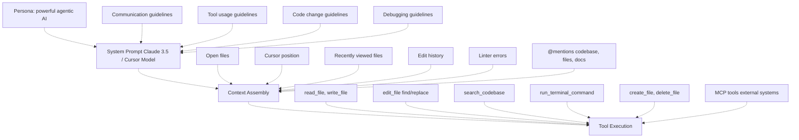
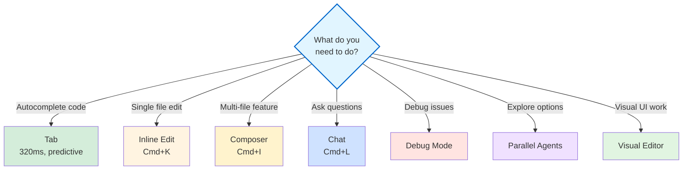
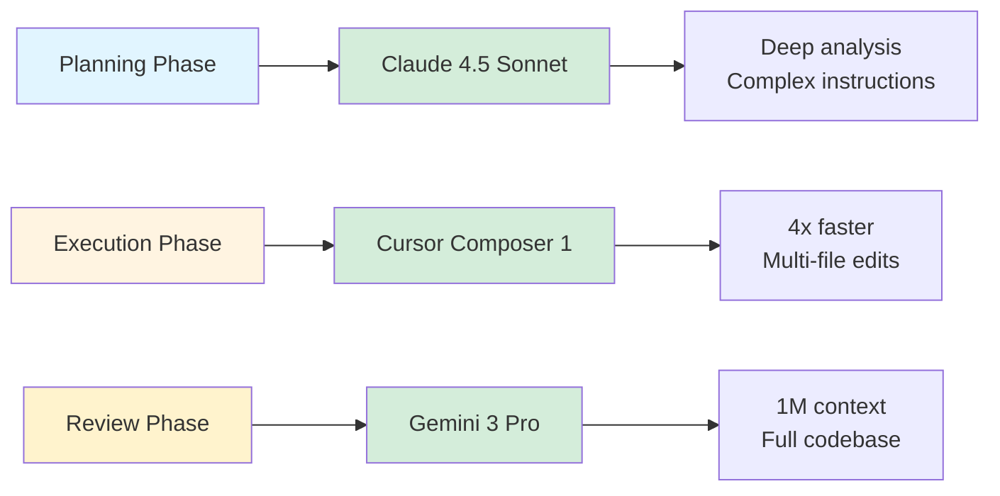
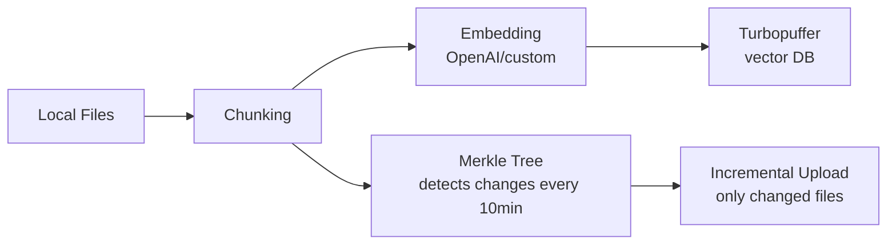

# Part 1, Section 1: Mental Models & Architecture

**Part of**: [Cursor IDE: Complete Technical Guide](../../README.md)  
**Estimated reading time**: 45 minutes  
**Prerequisites**: None - start here!

---

## 📋 Overview

Before diving into Cursor IDE, you need to understand **how it thinks** and **how you should think about it**. This section builds the mental models that will make everything else click.

**What you'll learn:**
- The Cursor IDE ecosystem and its components
- How different AI models work and when to use each
- The architecture of Tab, Inline Edit, Agent, and Composer
- How codebase indexing and context management work
- Rules architecture and Model Context Protocol (MCP)

**Why this matters:** Understanding these concepts prevents frustration and unlocks Cursor's full potential. You'll know *why* something works, not just *how* to use it.

---

## 🧠 The Cursor IDE Ecosystem

### Core Architecture

**Agent System Prompt Structure**



**Why this matters:** Cursor isn't a monolithic LLM—it's an orchestration layer that:
- Maintains conversation state but has **no memory** between completions
- Feeds full history + state in each request (context window management critical)
- Uses provider-native tool calling (Anthropic, OpenAI, Gemini formats)
- Runs tools **client-side** (Cursor orchestrates, not the LLM)
- Can connect to external systems via MCP (Model Context Protocol)

---

## 🔧 Tool Selection Matrix

Understanding when to use each Cursor feature is critical for productivity.

### Tab (Autocomplete)
**Fast, predictive code completion**

- Uses custom 8B-param model trained on code patterns
- ~320ms latency (vs GitHub Copilot's 890ms)
- Predicts next edit location
- Auto-imports unresolved symbols (TypeScript/Python)
- **When to use:** Boilerplate, repetitive patterns, known APIs

**Example use cases:**
- Writing import statements
- Completing function signatures
- Generating test boilerplate
- Auto-completing API calls

---

### Cmd+K (Inline Edit)
**Surgical, focused changes**

- Single-file scope, focused edits
- Shows diff (red = removed, green = added)
- Fast response time
- **When to use:** Refactoring a function, renaming, small fixes

**Example use cases:**
- Refactor a function to use async/await
- Rename variables consistently
- Add error handling to existing code
- Convert class to functional component

**Keyboard shortcut:**
- Windows/Linux: `Ctrl+K`
- macOS: `Cmd+K`

---

### Cmd+I (Composer / Agent)
**Multi-file orchestration**

- **NEW in Cursor 2.0:** Cursor's own frontier model (4x faster)
- Multi-file edits with dependency tracking
- Can reference `@codebase`, `@folder`, `@docs`, `@web`
- Built-in Plan Mode for complex tasks
- **When to use:** Large refactors, migrations, architectural changes

**Example use cases:**
- Migrate REST API to GraphQL
- Refactor class components to hooks across multiple files
- Add authentication to entire application
- Generate tests for multiple modules

**Keyboard shortcut:**
- Windows/Linux: `Ctrl+I`
- macOS: `Cmd+I`

---

### Chat (Ask/Edit/Agent Mode)
**Conversational coding**

- **Ask Mode:** Q&A, explanations, planning (read-only)
- **Edit Mode:** Apply changes directly to files
- **Agent Mode:** Autonomous file creation, searches, terminal commands
- **When to use Agent:** Cross-cutting changes, scaffolding, TDD loops

**Example use cases:**
- Ask: "How does authentication work in this codebase?"
- Edit: "Add error handling to all API calls"
- Agent: "Set up Jest testing with coverage reports"

**Keyboard shortcut:**
- Windows/Linux: `Ctrl+L`
- macOS: `Cmd+L`

---

### Debug Mode (NEW)
**Hypothesis-driven debugging**

- Agent generates hypotheses → instruments code → collects logs → fixes
- Works across languages/stacks
- **When to use:** Elusive bugs, race conditions, runtime issues

**Example use cases:**
- Debugging intermittent test failures
- Finding race conditions in async code
- Tracking down memory leaks
- Understanding performance bottlenecks

---

### Parallel Agents (NEW in 2.0)
**Run multiple agents simultaneously**

- Uses git worktrees or remote machines
- Auto-evaluates and picks best solution
- Up to 8 agents in parallel
- **When to use:** Exploring multiple approaches, complex refactors

**Example use cases:**
- Compare different implementation approaches
- Test multiple refactoring strategies
- Explore various architectural patterns
- A/B test different solutions

---

### Visual Editor (NEW Dec 2025)
**Design + code simultaneously**

- Chrome DevTools-style inspection
- Click, drag, style components
- Real-time visual feedback
- **When to use:** UI development, visual debugging

**Example use cases:**
- Adjusting component layouts
- Fine-tuning CSS styles
- Visual debugging of responsive designs
- Rapid UI prototyping

---

## 🎯 Tool Selection Decision Tree



**Trade-off:** Agent/Composer have higher latency but avoid "golf the prompt" cycles. Use Tab for speed, Agent for correctness.

---

## 🤖 Model Selection Guide

### Available Models (2026)

Based on official Cursor documentation, here are the current models:

#### Claude 4.5 Opus
- **Provider:** Anthropic
- **Context:** 200k tokens (default), 200k (max mode)
- **Capabilities:** Agent, Thinking, Image support
- **Best for:** Complex reasoning, deep analysis

#### Claude 4.5 Sonnet (Chat default)
- **Provider:** Anthropic
- **Context:** 200k tokens (default), 1M (max mode)
- **Capabilities:** Agent, Thinking, Image support
- **Best for:** Understanding legacy code, following complex instructions
- **Strong reasoning capabilities**

#### Cursor Composer 1
- **Provider:** Cursor (custom model)
- **Context:** 200k tokens
- **Capabilities:** Agent, Image support
- **Best for:** Multi-file refactors, fast execution
- **4x faster than comparable models**

#### Gemini 3 Flash
- **Provider:** Google
- **Context:** 200k tokens (default), 1M (max mode)
- **Capabilities:** Agent, Thinking, Image support
- **Best for:** Large monorepos, full-context analysis

#### Gemini 3 Pro
- **Provider:** Google
- **Context:** 200k tokens (default), 1M (max mode)
- **Capabilities:** Agent, Thinking, Image support
- **Best for:** Massive codebases, comprehensive reviews

#### GPT-5.1 Codex Max
- **Provider:** OpenAI
- **Context:** 272k tokens
- **Capabilities:** Agent, Thinking, Image support
- **Best for:** Code-specific tasks, fast responses

#### GPT-5.2
- **Provider:** OpenAI
- **Context:** 272k tokens
- **Capabilities:** Agent, Thinking, Image support
- **Best for:** General purpose, balanced performance

#### Grok Code
- **Provider:** xAI
- **Context:** 256k tokens
- **Capabilities:** Agent, Thinking
- **Best for:** Alternative perspective, code analysis

---

### Model Switching Strategy



**Recommended workflow:**
1. **Planning phase** → Claude 4.5 Sonnet (deep analysis)
2. **Execution phase** → Cursor Composer 1 (speed)
3. **Review phase** → Gemini 3 Pro (full context)

---

## 📊 Context Windows & Indexing

### Codebase Indexing Pipeline



### Key Stats

- ~8,000 lines max context per request (Cursor)
- Cursor Composer: Optimized for coding context
- Gemini 3 Pro: ~100,000+ lines (massive context with 1M tokens)
- Embeddings stored with obfuscated paths + line ranges
- Code **never stored server-side** (only embeddings + metadata)

### Privacy Model

- Embeddings are reversible for short strings (academic attacks exist)
- Cursor uses encryption + obfuscation to mitigate
- Privacy Mode disables cloud indexing, keeps embeddings local

### When @Codebase triggers:

1. Query embedding computed locally
2. Vector search in Turbopuffer (nearest neighbors)
3. Client receives obfuscated paths + line ranges
4. Client reads local files → sends to LLM

**Why Cursor is fast:** No pre-processing wait. Indexing runs in background, queries hit cached embeddings.

---

## 📜 Rules Architecture

### Current Format (2026)

Cursor rules have evolved to a more powerful structure:

- **Project Rules** (`.cursor/rules/`) - **RECOMMENDED** ✅
  - Each rule is a folder with `RULE.md` file
  - Frontmatter metadata controls when rules apply
  - Version-controlled and scoped to your codebase
  
- **AGENTS.md** - Simple alternative
  - Plain markdown file in project root
  - No metadata or complex configuration
  - Supports nested files in subdirectories
  
- **User Rules** - Global preferences in Cursor Settings
  - Apply across all projects
  - Perfect for personal coding style
  
- **Team Rules** - Dashboard-managed (Team/Enterprise)
  - Centrally managed by admins
  - Can be enforced for all team members
  - Plain text format
  
- **`.cursorrules`** - **LEGACY** ⚠️
  - Single file format (will be deprecated)
  - Migrate to Project Rules or AGENTS.md

### How Rules Work (Non-Obvious)

**Important:** Rules are included in model context based on their type:

| Rule Type | When Applied |
|-----------|--------------|
| **Always Apply** | Included in every chat session |
| **Apply Intelligently** | Agent decides based on `description` field |
| **Apply to Specific Files** | When file matches `globs` pattern |
| **Apply Manually** | When @-mentioned in chat (e.g., `@typescript`) |

### Rule Precedence

When multiple rules apply, they are merged in this order:
1. **Team Rules** (highest priority)
2. **Project Rules**
3. **User Rules** (lowest priority)

### Implications

**Write rules as encyclopedia articles, not commands:**

❌ **DON'T:**
```
You are a senior engineer using React 18.
Always use functional components.
```

✅ **DO:**
```markdown
---
description: "React 18 patterns and best practices"
alwaysApply: false
---

# React 18 Patterns

## Component Architecture
- Use functional components with hooks
- Avoid class components (legacy pattern)
- Use TypeScript for type safety

## State Management
- useState for local state
- useContext for shared state
- React Query for server state
```

### Team Rules (Team/Enterprise Plans)

- Managed from [Cursor dashboard](https://cursor.com/dashboard?tab=team-content)
- Can be enforced (required for all team members)
- Plain text format (no frontmatter)
- Apply across all repositories for the team

### Rule Management (Monorepos)

Project Rules and AGENTS.md can be nested:

```
project/
  .cursor/rules/        # Root-level rules
  AGENTS.md             # Global instructions
  frontend/
    .cursor/rules/      # Frontend-specific rules
    AGENTS.md           # Frontend instructions
  backend/
    .cursor/rules/      # Backend-specific rules
    AGENTS.md           # Backend instructions
```

**Benefits:**
- Granular control per area of codebase
- More specific instructions take precedence
- No need for separate workspaces

---

## 🔌 Model Context Protocol (MCP)

**NEW in Cursor 2.0:** Standardized protocol for connecting external tools and data sources.

### What is MCP

- Protocol for LLMs to access external systems
- One-click OAuth setup for popular services
- Bidirectional communication (read/write)
- Client-side execution (secure)

### Available MCP Servers (2026)

- **Google Drive**: Search and read documents
- **Slack**: Read channels, send messages
- **GitHub**: Query repos, create issues/PRs
- **Linear**: Manage issues and projects
- **PostgreSQL**: Query databases
- **Kubernetes**: Manage clusters
- **Custom**: Build your own

### MCP vs @Docs

- **@Docs:** Static documentation (indexed once)
- **MCP:** Live data (queries on demand)

### Setup Example

```json
// .cursor/mcp.json
{
  "mcpServers": {
    "gdrive": {
      "command": "npx",
      "args": ["-y", "@modelcontextprotocol/server-gdrive"],
      "env": {
        "GDRIVE_CLIENT_ID": "${GDRIVE_CLIENT_ID}",
        "GDRIVE_CLIENT_SECRET": "${GDRIVE_CLIENT_SECRET}"
      }
    }
  }
}
```

### Current Limitations

- 40 tool limit per session
- SSH connectivity issues (known bug)
- Some servers require manual OAuth setup

---

## 📚 Context7 MCP - Live Documentation

**Pre-configured in Cursor 2.0** - No setup required.

### What it Provides

- Real-time, version-specific library documentation
- 10,000+ libraries with official docs and code examples
- Two modes: `code` (API reference) and `info` (guides)
- Auto-resolves library names to Context7-compatible IDs

### Usage Patterns

#### Pattern 1: Implicit (Recommended)
```
Implement file upload using AWS SDK v3 S3 client.
Follow latest best practices.
```
Agent automatically uses Context7 for latest docs. Watch for 🔧 tool indicators.

#### Pattern 2: Explicit Version
```
Use React Query v5.62.0 to implement data fetching.
Check Context7 for version-specific breaking changes.
```
Forces Context7 lookup for specific version (training data won't have recent versions).

#### Pattern 3: Migration
```
Migrate from Next.js 14 to 15.
Use Context7 to compare App Router changes between versions.
```
Context7 fetches both versions for comparison.

### Quick Verification

Ask agent to cite version number. If it shows exact recent version (e.g., "v5.62.0"), Context7 was used.

### When Context7 Beats @Docs

- Library updates frequently (React, Next.js, AWS SDK)
- Need specific version (not latest)
- Setup/configuration steps (build tools, CI/CD)
- Training data is >6 months old

### When to Use @Docs Instead

- Custom/internal documentation
- Static content (faster, cached locally)
- Privacy-sensitive projects

---

## 🎯 Key Takeaways

### Tool Selection
- **Tab** for fast autocomplete (320ms)
- **Cmd+K** for single-file edits
- **Cmd+I** for multi-file features
- **Agent** for autonomous work
- **Debug Mode** for elusive bugs
- **Parallel Agents** for exploration

### Model Selection
- **Claude 4.5 Sonnet** for planning and analysis
- **Cursor Composer 1** for fast execution
- **Gemini 3 Pro** for full codebase review

### Context Management
- Clean `.cursorignore` = faster indexing
- Close irrelevant tabs before agent tasks
- Use `@codebase` for semantic search
- Embeddings stored securely, code never leaves machine

### Rules Architecture
- Write rules as encyclopedia articles with frontmatter metadata
- Use `.cursor/rules/*/RULE.md` folder structure (2026 format)
- Or use `AGENTS.md` for simple instructions
- Team Rules managed from dashboard

### MCP Integration
- Connect to external systems (Slack, GitHub, databases)
- Context7 provides live documentation
- Watch for 🔧 tool indicators

---

## 📖 Next Steps

Now that you understand Cursor's architecture and mental models, proceed to:

**[Section 2: Environment & Project Setup →](./02-environment-project-setup.md)**

Learn how to configure Cursor IDE optimally for your projects, set up `instructions.md`, configure rules, and prepare your development environment.

---

**Part 1, Section 1** | [Back to Part 1 Index](./README.md) | [Next: Section 2 →](./02-environment-project-setup.md)
