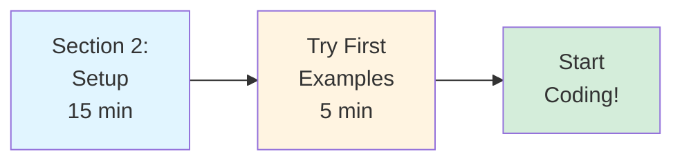
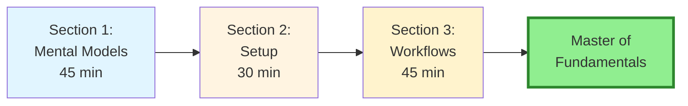
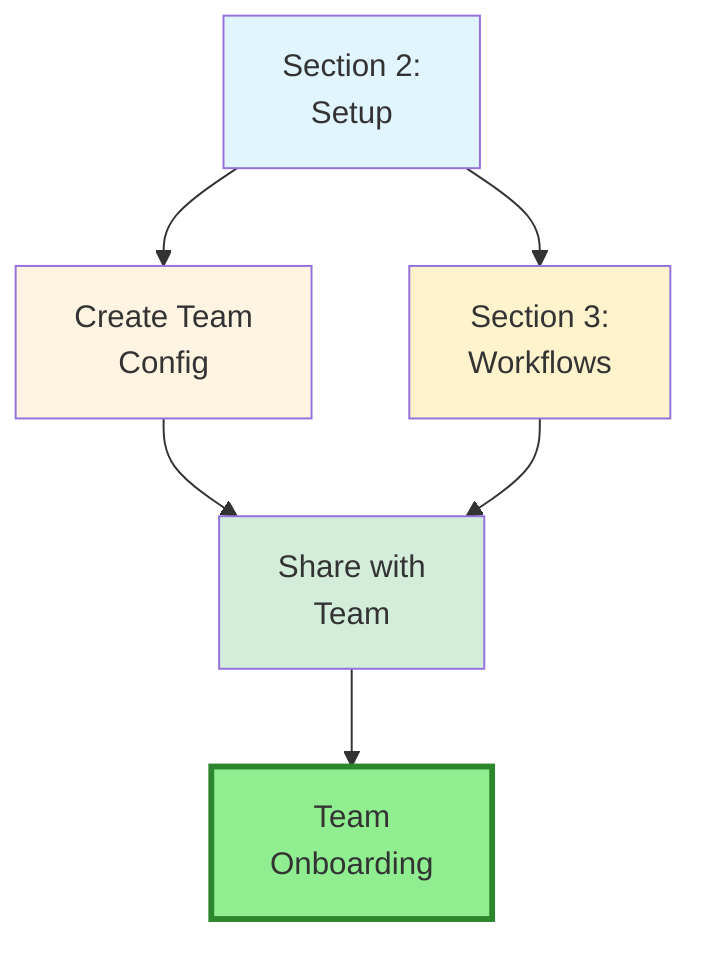
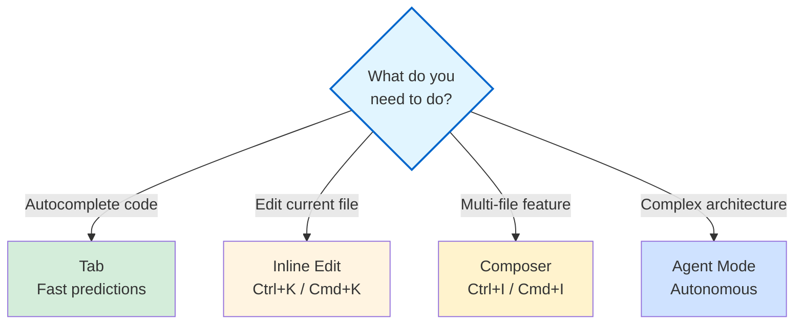

# Part 1: Fundamentals & Core Concepts

**Target Audience:** Essential foundations for all users  
**Time to Complete:** 2 hours (can be split across multiple sessions)  
**Prerequisites:** None - start here if you're new to Cursor IDE

---

## 📋 Overview

Part 1 establishes the foundational knowledge you need to use Cursor IDE effectively. Whether you're a solo developer or part of a team, these sections will get you from zero to productive in hours, not days.

**What you'll learn:**
- How Cursor IDE works and when to use each feature
- Setting up your development environment correctly
- Essential workflows for daily development
- Best practices for team collaboration

---

## 📚 Sections

### [Section 1: Mental Models & Architecture](./01-mental-models-architecture.md) ✅
**Status:** ✅ Complete  
**Time:** 45 minutes  
**What you'll learn:**
- How Cursor's AI models work
- The difference between Tab, Inline Edit, Agent, and Composer
- When to use each tool (Tab vs Cmd+K vs Cmd+I)
- Understanding context windows and codebase indexing
- Model Context Protocol (MCP) basics
- Rules architecture: Project Rules and AGENTS.md

**Key concepts:**
- Claude 4.5 series (Opus, Sonnet)
- GPT-5 series and GPT-5.2
- Gemini 3 series for long context
- Cursor's custom Composer model (200k context)
- Agent system prompt structure
- Tool selection matrix

---

### [Section 2: Environment & Project Setup](./02-environment-project-setup.md) ✅
**Status:** ✅ Complete  
**Time:** 30-45 minutes  
**What you'll learn:**
- Installing Cursor IDE and initial configuration
- Choosing the right subscription tier
- Codebase indexing strategies (small repos vs monorepos)
- Creating `instructions.md` for project context
- Setting up Project Rules in `.cursor/rules/` or using AGENTS.md
- Configuring `.cursorignore` properly
- Commands feature for reusable team prompts

**Key takeaways:**
- Workspace settings override user settings
- `instructions.md` is your single source of truth
- Clean `.cursorignore` = faster indexing
- Test your setup before proceeding

**Quick setup checklist:**
```bash
✅ Install Cursor IDE
✅ Sign in to your account
✅ Create instructions.md
✅ Create .cursor/rules/ with RULE.md files OR create AGENTS.md
✅ Configure .cursorignore
✅ Test Tab, Inline Edit, and Agent
```

---

### [Section 3: Core Workflows](./03-core-workflows.md) ✅
**Status:** ✅ Complete  
**Time:** 45 minutes  
**What you'll learn:**
- TDD workflow with Agent (test-first pattern)
- Refactoring pattern (multi-step, incremental)
- Debug Mode workflow (hypothesis-driven)
- Parallel agents (exploring multiple approaches)
- Infrastructure-as-Code workflows
- Progressive enhancement pattern

**Workflows covered:**
1. **TDD Pattern** - Test-first development with Agent
2. **Refactoring** - Multi-step incremental refactoring
3. **Debugging** - Hypothesis-driven debugging with Debug Mode
4. **Parallel Agents** - Exploring multiple solutions
5. **Infrastructure** - Terraform, CDK, serverless
6. **Progressive Enhancement** - Iterative feature development

**Key takeaways:**
- Always plan before implementing
- Use incremental approach for complex changes
- Commit before major agent changes
- Review diffs before accepting
- Run tests after agent changes

---

## 🎯 Learning Paths

### Path A: "I Want to Start Coding Now" (15 minutes)
**Goal:** Get productive immediately



**Steps:**
1. Complete [Section 2: Environment & Project Setup](./02-environment-project-setup.md)
2. Try the "First 5 Minutes" examples from the guide
3. Start using Tab and Inline Edit in your work

**When to come back:** After a few hours of use, complete Sections 1 and 3 to deepen understanding.

---

### Path B: "I Want Complete Mastery" (2 hours)
**Goal:** Understand everything deeply



**Steps:**
1. Read Section 1 to understand how Cursor works
2. Complete Section 2 setup with `instructions.md` and rules
3. Learn Section 3 workflows and practice each one
4. Move to [Part 2: Advanced Features](../02-advanced-features-visual-dev/) for advanced patterns

---

### Path C: "I'm Setting Up My Team" (1 hour)
**Goal:** Team enablement and consistency



**Focus areas:**
1. **Section 2:** 
   - Workspace `instructions.md`
   - Project Rules (`.cursor/rules/`) or AGENTS.md
   - Team `.cursorignore` patterns
   - Commands for common tasks
2. **Section 3:** 
   - Core workflows everyone should follow
   - TDD and refactoring patterns
3. **Team enablement:**
   - Commit configurations to git
   - Schedule training session
   - Create team prompt library

---

## 🎓 After Completing Part 1

### You'll be able to:

✅ **Understand** how Cursor's AI models work and when to use each  
✅ **Choose** the right tool for each task (Tab, Inline Edit, Agent, Composer)  
✅ **Configure** Cursor IDE optimally for your projects  
✅ **Write** `instructions.md` and rules for team consistency  
✅ **Use** the TDD and refactoring workflows  
✅ **Debug** with hypothesis-driven approach  
✅ **Set up** parallel agents for exploration  
✅ **Navigate** unfamiliar codebases faster  

### Next steps:

- **[Part 2: Advanced Features & Visual Development](../02-advanced-features-visual-dev/)** - Complex workflows and visual patterns
- **[Part 3: DevOps & Backend Architecture](../03-devops-backend-architecture/)** - Infrastructure and backend patterns
- **[Part 4: Context Management & Prompting](../04-context-management-prompting/)** - Mastering context and advanced prompts

---

## 🚀 Quick Reference

### Essential Keyboard Shortcuts

| Feature | Description | Shortcut/Command |
| :--- | :--- | :--- |
| **Tab** | Fast autocomplete | `Tab` |
| **Cmd+K** | Inline surgical edits | `Cmd+K` |
| **Terminal K** | AI command generation | `Ctrl+K` (in terminal) |
| **Composer** | Multi-file orchestration | `Cmd+I` / `Cmd+Shift+I` |
| **Agent** | Autonomous task execution | Agent Mode in Chat/Composer |
| **Cloud Agent** | Background cloud execution | Switch to Cloud in Composer |
| **CLI Agent** | Terminal-based autonomous AI | `cursor agent "task"` |
| **Bugbot** | Automated PR reviews | `.cursor/BUGBOT.md` |
| **MCP** | External tool integration | `.cursor/mcp.json` |
| **Rules** | Project-specific guardrails | `.cursor/rules/*/RULE.md` |
| **Parallel Agents** | Simultaneous task execution | `Cmd+Shift+P` > Parallel Agents |

### When to Use Each Feature



### Tool Selection Quick Reference

| Task Type | Use This | Why |
|-----------|----------|-----|
| Boilerplate, imports | **Tab** | Fastest (320ms), predictive |
| Single-line fix | **Inline Edit (Cmd+K)** | Surgical, shows diff |
| Refactor function | **Inline Edit (Cmd+K)** | Focused scope, fast |
| Multi-file feature | **Composer (Cmd+I)** | Multi-file orchestration |
| Complex architecture | **Agent Mode** | Autonomous, cross-cutting |
| Elusive bugs | **Debug Mode** | Hypothesis-driven |
| Exploring approaches | **Parallel Agents** | Best-of-N solutions |

---

## 💡 Pro Tips for Part 1

### Tip 1: Start with Tab and Inline Edit
Don't overwhelm yourself. Master **Tab** for autocomplete and **Cmd+K** for focused edits first. Move to Composer and Agent after you're comfortable.

### Tip 2: Create `instructions.md` First
Always start new projects with `instructions.md`:
- Project overview and architecture
- Coding standards and conventions
- Common patterns and anti-patterns
- Testing requirements
- Deployment process

### Tip 3: Clean `.cursorignore` = Fast Indexing
Exclude non-code files:
```
node_modules/
dist/
build/
*.log
*.lock
.git/
```

### Tip 4: Test Immediately
After setup, test all three interfaces:
1. Type a function and wait for Tab completion
2. Press `Cmd+K` and ask to refactor code
3. Open Composer (`Cmd+I`) and ask about your codebase

### Tip 5: Iterate on Prompts
Don't accept first result - refine your requests:
- ❌ "Fix this code"
- ✅ "Refactor this function to use async/await and add error handling"

---

## 📖 Additional Resources

### Official Documentation
- [Cursor Website](https://cursor.com)
- [Cursor Docs](https://cursor.com/docs)
- [Cursor Changelog](https://cursor.com/changelog)

### Community
- [Cursor Forum](https://forum.cursor.com)
- [Cursor Discord](https://cursor.com/discord)

### From This Guide
- [Master Index](../../README.md) - Full guide structure
- [Quick Reference](../06-troubleshooting-reference/02-reference-prompts-templates.md) - Command cheat sheet
- [Troubleshooting](../06-troubleshooting-reference/04-troubleshooting-guide.md) - Common issues

---

## ✅ Part 1 Completion Checklist

Before moving to Part 2, ensure you've:

- [ ] **Understand** the different Cursor features (Tab, Inline Edit, Agent, Composer)
- [ ] **Installed** Cursor IDE and configured it
- [ ] **Created** `instructions.md` for your project
- [ ] **Set up** Project Rules in `.cursor/rules/` OR created `AGENTS.md`
- [ ] **Configured** `.cursorignore` properly
- [ ] **Tested** Tab, Inline Edit, and Composer
- [ ] **Practiced** at least 3 examples from "First 5 Minutes"
- [ ] **Can explain** when to use each tool

**Success metric:** You can confidently use Cursor for daily coding tasks and understand which feature to use when.

---

**Part 1 Status:** ✅ Complete (All sections finished)  
**Last Updated:** January 2026  
**Next Part:** [Part 2: Advanced Features & Visual Development](../02-advanced-features-visual-dev/)

---

**Ready to continue?** Start with [Section 1: Mental Models & Architecture](./01-mental-models-architecture.md) →
