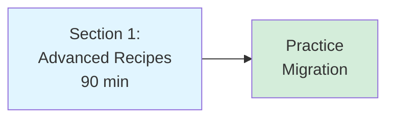
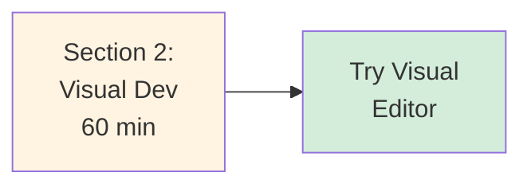
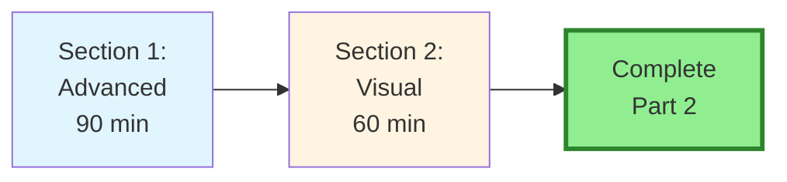
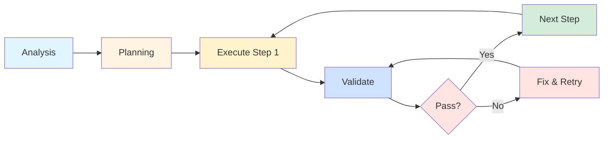

# Part 2: Advanced Features & Visual Development

**Target Audience:** Developers ready for complex workflows  
**Time to Complete:** 2-3 hours  
**Prerequisites:** [Part 1: Fundamentals & Core Concepts](../01-fundamentals-core-concepts/)

---

## 📋 Overview

Part 2 covers advanced techniques and visual development patterns that go beyond basic workflows. Learn how to handle complex multi-phase tasks and leverage Cursor's visual capabilities.

**What you'll learn:**
- Complex multi-phase workflows (API migrations, database migrations)
- Large-scale refactoring strategies
- Screenshot-driven development
- Visual Editor workflows
- Comparative visual debugging

---

## 📚 Sections

### [Section 1: Advanced Recipes](./01-advanced-recipes.md) ✅
**Status:** ✅ Complete  
**Time:** 90 minutes  
**What you'll learn:**
- API migration (REST → GraphQL)
- Database schema migrations with Prisma
- Large-scale refactoring (Class → Hooks)
- Dependency upgrades (major versions)
- Micro-frontend integration

**Key patterns:**
- Analysis → Plan → Execute phases
- Incremental migration strategies
- Validation at each step
- Rollback plans

---

### [Section 2: Visual Development Patterns](./02-visual-development-patterns.md) ✅
**Status:** ✅ Complete  
**Time:** 60 minutes  
**What you'll learn:**
- Screenshot-to-code development
- Comparative visual debugging
- Visual Editor workflow (NEW in Dec 2025)
- Reverse engineering UIs
- Screenshot-driven refactoring

**Key techniques:**
- Image upload for exact visual reference
- Side-by-side comparison debugging
- Real-time visual styling
- Component extraction from screenshots

---

## 🎯 Learning Paths

### Path A: "API Developer" (90 minutes)
**Focus:** API migrations and backend patterns

**Steps:**
1. Study API migration patterns (REST → GraphQL)
2. Learn database migration strategies
3. Practice with a sample migration

---

### Path B: "Frontend Developer" (60 minutes)
**Focus:** Visual development and UI patterns

**Steps:**
1. Learn screenshot-to-code workflow
2. Try Visual Editor on a component
3. Practice comparative debugging

---

### Path C: "Full-Stack Mastery" (2.5 hours)
**Goal:** Master all advanced patterns

---

## 🎓 After Completing Part 2

### You'll be able to:

✅ **Execute** complex multi-phase migrations  
✅ **Refactor** large codebases incrementally  
✅ **Migrate** APIs and databases safely  
✅ **Upgrade** major dependencies systematically  
✅ **Build** UIs from screenshots  
✅ **Debug** visual issues comparatively  
✅ **Use** Visual Editor for rapid styling  

### Next steps:

- **[Part 3: DevOps & Backend Architecture](../03-devops-backend-architecture/)** - Infrastructure and backend patterns
- **[Part 4: Context Management & Prompting](../04-context-management-prompting/)** - Advanced context strategies

---

## 🚀 Quick Reference

### Migration Workflow

### Visual Development Quick Tips

| Task | Tool | Shortcut |
|------|------|----------|
| Screenshot to code | Composer + Image | Upload image |
| Visual styling | Visual Editor | Right-click element |
| Compare designs | Side-by-side screenshots | Upload 2 images |
| Extract component | Composer + Image | "Extract this component" |

---

## 💡 Pro Tips for Part 2

### Tip 1: Always Analyze First
Before any migration, spend time analyzing the current state. Understanding what you have prevents surprises later.

### Tip 2: Break Into Phases
Large migrations should be broken into 3-5 phases. Each phase should be independently testable and deployable.

### Tip 3: Use Screenshots Liberally
Screenshots are worth a thousand words. Upload them for exact visual reference when building UIs.

### Tip 4: Validate After Each Step
Don't move to the next step until the current one passes all tests and validation.

### Tip 5: Plan Rollback Strategy
Always have a rollback plan. Know how to undo each step if something goes wrong.

---

## 📖 Additional Resources

### Official Documentation
- [Cursor Visual Editor](https://cursor.com/docs)
- [Cursor Agent](https://cursor.com/docs/agent/overview)

### From This Guide
- [Part 1: Fundamentals](../01-fundamentals-core-concepts/) - Core concepts
- [Part 3: DevOps](../03-devops-backend-architecture/) - Infrastructure patterns
- [Troubleshooting](../06-troubleshooting-reference/) - Common issues

---

## ✅ Part 2 Completion Checklist

Before moving to Part 3, ensure you've:

- [ ] **Understand** multi-phase migration workflow
- [ ] **Can break** large tasks into incremental steps
- [ ] **Know** when to use Analysis → Plan → Execute
- [ ] **Practiced** screenshot-to-code workflow
- [ ] **Tried** Visual Editor on a component
- [ ] **Can** debug visual issues comparatively

**Success metric:** You can confidently handle complex migrations and visual development tasks.

---

**Part 2 Status:** ✅ Complete (All sections finished)  
**Last Updated:** January 2026  
**Next Part:** [Part 3: DevOps & Backend Architecture](../03-devops-backend-architecture/)

---

**Ready to continue?** Start with [Section 1: Advanced Recipes](./01-advanced-recipes.md) →
