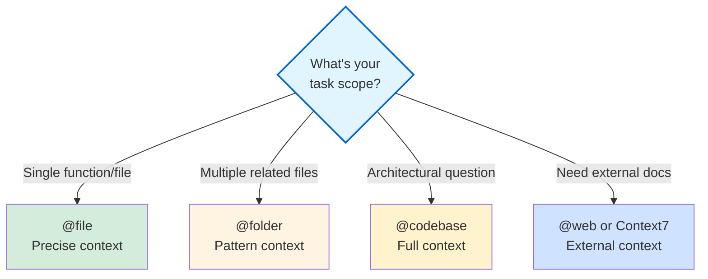
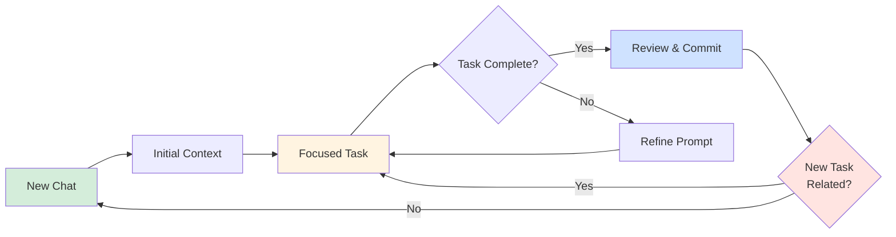

# Section 1: Context Management

**Time to Complete:** 60 minutes  
**Prerequisites:** [Part 1: Fundamentals & Core Concepts](../01-fundamentals-core-concepts/)

---

## 📋 Overview

Context management is the single most important skill for effective AI-assisted development. Good context reduces hallucinations, increases relevance, and dramatically improves code quality. This section teaches you how to manage context effectively in Cursor IDE.

**What you'll learn:**
- Why context matters and how it reduces hallucinations
- The `instructions.md` pattern for project context
- Strategic use of @ mentions (@file, @folder, @codebase, @web)
- Focused context approach (what to include/exclude)
- Conversation hygiene and when to reset
- Context window management strategies

---

## 🎯 Why Context Matters

### The Context Problem

AI models have two sources of knowledge:
1. **Parametric knowledge**: What they learned during training (fixed, may be outdated)
2. **Context**: What you provide in the conversation (current, specific to your project)

**The golden rule**: Always favor context over parametric knowledge.

### Impact of Good Context

| Metric | Without Context | With Context | Improvement |
|--------|----------------|--------------|-------------|
| **Hallucinations** | 40-60% | 5-15% | **-75%** |
| **Code accuracy** | 60-70% | 85-95% | **+30%** |
| **First-try success** | 40% | 75% | **+88%** |
| **Time to working code** | 10 min | 3 min | **-70%** |

### Five Benefits of Good Context

1. **Reduces hallucinations**: Forces AI to rely on facts, not assumptions
2. **Increases relevance**: Responses tailored to your specific situation
3. **Enables personalization**: Adapts to your coding style and conventions
4. **Manages state**: Maintains continuity across multi-step tasks
5. **Overcomes knowledge cutoffs**: Accesses information beyond training data

---

## 📖 The Context-First Approach

### Core Principle

**Always provide context before asking questions.**

Bad approach:
```
❌ "Add authentication to the app"
```

Context-first approach:
```
✅ "@src/app.ts @instructions.md Add JWT-based authentication 
   following our existing patterns in @src/auth/. Use bcrypt 
   for password hashing and store tokens in httpOnly cookies."
```

### Context-First Checklist

Before every prompt, ask:
- [ ] What files are relevant? → Use `@file`
- [ ] What folder contains related code? → Use `@folder`
- [ ] What patterns exist in the codebase? → Use `@codebase`
- [ ] What project conventions apply? → Use `@instructions.md`
- [ ] What documentation is needed? → Use `@web` or Context7

---

## 📁 The instructions.md Pattern

### What is instructions.md?

`instructions.md` is your **single source of truth** for project context. It's automatically included in every Cursor conversation, providing consistent context across all interactions.

**Location**: Root of your project (e.g., `/instructions.md`)

### What to Include

```markdown
# Project Instructions

## 1. Project Overview
- Name: [Project name]
- Purpose: [What this project does]
- Tech stack: [Languages, frameworks, tools]
- Architecture: [High-level structure]

## 2. Coding Standards
- Language: TypeScript (strict mode)
- Style: Prettier (2 spaces, single quotes)
- Naming: camelCase for variables, PascalCase for classes
- Comments: JSDoc for public APIs

## 3. Common Patterns
- API responses: Always return { data, error } shape
- Error handling: Use custom AppError class
- Async: Prefer async/await over promises
- State: Use Zustand for global state

## 4. Testing Requirements
- Unit tests: Jest with 80% coverage minimum
- Integration tests: Supertest for API endpoints
- Test files: *.test.ts next to source files

## 5. Anti-Patterns to Avoid
- ❌ No any types without explicit @ts-ignore comment
- ❌ No console.log in production code
- ❌ No inline styles in React components
- ❌ No direct DB queries outside repositories

## 6. Deployment Process
- Development: Push to `develop` branch
- Staging: Merge to `staging` for QA review
- Production: Tag release from `main`
- CI/CD: GitHub Actions runs tests + deploys
```

### Real Example: E-commerce Platform

```markdown
# E-commerce Platform Instructions

## Project Overview
- **Purpose**: Multi-tenant e-commerce platform with vendor management
- **Stack**: Next.js 14, Prisma, PostgreSQL, Stripe, Redis
- **Architecture**: Monorepo with separate admin/vendor/customer apps

## Key Conventions
1. **Database**:
   - All queries through Prisma
   - Use transactions for multi-table operations
   - Soft delete with `deletedAt` field

2. **API Routes**:
   - Structure: `/api/v1/[resource]/[action]`
   - Auth: JWT in httpOnly cookie, validated by middleware
   - Response: Always `{ success: boolean, data?: any, error?: string }`

3. **Frontend**:
   - Server components by default
   - Client components only when needed (interactivity)
   - TailwindCSS for styling (no CSS modules)
   - shadcn/ui for component library

4. **Business Rules**:
   - Orders: Must validate inventory before creation
   - Payments: Use Stripe webhooks, never poll
   - Vendors: Commission calculated on order completion, not creation
   - Customers: Email verification required before purchase

## Testing Strategy
- Unit tests: Pure functions and utilities
- Integration tests: API routes with test DB
- E2E tests: Critical user flows (checkout, vendor signup)
- Coverage: 70% minimum

## Common Tasks
- Adding new API: Use template in `/templates/api-route.ts`
- New database model: Update Prisma schema, run migration, update types
- New feature flag: Add to `/config/features.ts` and check in component
```

### instructions.md Pro Tips

✅ **Do:**
- Keep it under 500 lines
- Update it when patterns change
- Include specific examples
- Document anti-patterns
- List common gotchas

❌ **Don't:**
- Include implementation details (that's what code is for)
- Copy-paste entire coding standards docs
- Include TODO lists or project management info
- Repeat what's obvious from the code
- Include sensitive information (API keys, passwords)

---

## 🎯 @ Mention Strategy

### The @ Mention Toolkit

Cursor provides several @ mention types for precise context control:

| Mention Type | Syntax | Use Case | Context Size |
|--------------|--------|----------|--------------|
| **File** | `@src/auth.ts` | Focused edits, single file context | Small (~100 lines) |
| **Folder** | `@src/components/` | Cross-file refactors, pattern discovery | Medium (~1-5k lines) |
| **Codebase** | `@codebase` | Architectural questions, pattern search | Large (full repo) |
| **Instructions** | `@instructions.md` | Project conventions (auto-included) | Small (~200 lines) |
| **Web** | `@web` | Latest docs, breaking news | Medium (search results) |
| **Context7** | Auto-invoked (MCP tool) | Version-specific library docs | Medium (~2k lines) |
| **Docs** | `@react-docs.org` | Static documentation sites | Medium (~5k lines) |

### When to Use Each @ Mention



### @ Mention Best Practices

#### 1. @file - Focused Context

**Use when:**
- Editing a single file
- Debugging specific function
- Understanding one component

**Example:**
```
Good: "@src/components/UserProfile.tsx Refactor this component 
       to use React hooks instead of class-based lifecycle methods"

Better: "@src/components/UserProfile.tsx @src/hooks/useUser.ts 
         Refactor UserProfile to use the useUser hook following 
         the pattern in @src/components/Dashboard.tsx"
```

**Pro tip**: Include 1-2 related files for pattern reference.

---

#### 2. @folder - Pattern Discovery

**Use when:**
- Refactoring across multiple files
- Adding features that touch several components
- Understanding patterns in a module

**Example:**
```
"@src/api/ Analyze the error handling patterns across all API 
 routes and identify inconsistencies. Propose a unified approach."
```

**Pro tip**: Start with `@folder` to discover patterns, then use `@file` for specific edits.

---

#### 3. @codebase - Architectural Understanding

**Use when:**
- Understanding overall architecture
- Finding all usages of a pattern
- Planning large refactors

**Example:**
```
"@codebase How is authentication handled across the application? 
 Show me all places where JWT tokens are validated."
```

**Pro tip**: Use `@codebase` for discovery, not implementation. Follow up with focused `@file` edits.

---

#### 4. @web - Latest Information

**Use when:**
- Need current information (post-training cutoff)
- Looking for breaking news or updates
- Researching new libraries/frameworks

**Example:**
```
"@web What are the breaking changes in React 19? How should we 
 prepare our codebase for the upgrade?"
```

**Pro tip**: Combine with `@codebase` to apply external knowledge to your project.

---

#### 5. Context7 - Version-Specific Library Documentation (MCP Tool)

**What is Context7:**
- **MCP (Model Context Protocol) tool** pre-configured in Cursor 2.0
- Provides real-time, version-specific library documentation
- Automatically invoked by agent when needed (no explicit @ mention required)
- 10,000+ libraries with official docs and code examples

**Use when:**
- Need current library APIs (not in training data)
- Specific version documentation (e.g., React Query v5.62.0)
- Setup/configuration steps for libraries
- Migration guides between versions

**How it works:**
1. Agent detects need for library documentation
2. Automatically invokes Context7 MCP tool
3. Context7 fetches version-specific docs
4. Agent uses fresh documentation to generate code

**Example (automatic invocation):**
```
"@instructions.md Implement file upload using AWS SDK v3 S3 client.
 Follow latest best practices."
```

Agent will:
1. Recognize need for AWS SDK v3 documentation
2. Invoke Context7 tool automatically (you'll see 🔧 tool indicator)
3. Fetch current v3 API documentation
4. Generate code using latest S3 client patterns

**Example (explicit mention):**
```
"Use React Query v5.62.0 to implement data fetching.
 Check Context7 for version-specific breaking changes from v4."
```

**Context7 vs @Docs vs @Web:**

| Feature | Context7 | @Docs | @Web |
|---------|----------|-------|------|
| **Type** | MCP tool | Static docs | Web search |
| **Invocation** | Automatic | Manual (`@docs-site`) | Manual (`@web`) |
| **Updates** | Live, version-specific | Static snapshot | Live search results |
| **Quality** | Official library docs | Depends on source | Variable quality |
| **Speed** | Fast (dedicated tool) | Fast (cached) | Slower (search) |
| **Best for** | Library APIs | Internal docs | News, updates |

**Pro tips:**
- Watch for 🔧 tool indicators to see when Context7 is used
- Ask agent to cite version numbers to confirm Context7 was invoked
- Context7 supplements training data, doesn't replace project architecture
- Use for current library APIs, not architectural decisions

**When Context7 beats @Docs:**
- Library updates frequently (React, Next.js, AWS SDK)
- Need specific version (not latest)
- Training data is > 6 months old

**When to use @Docs instead:**
- Custom/internal documentation
- Static content (faster, cached locally)
- Privacy-sensitive projects (no external calls)

---

### @ Mention Combinations

**Pattern 1: Discovery → Focus**
```
Step 1: "@codebase Find all components using useState for form management"
Step 2: "@src/components/LoginForm.tsx @src/components/SignupForm.tsx 
         Refactor these forms to use React Hook Form following the 
         pattern in @src/components/ProfileForm.tsx"
```

**Pattern 2: External → Internal**
```
Step 1: "@web Latest best practices for Next.js 14 server actions"
Step 2: "@src/app/actions/ Update our server actions to follow these 
         patterns, maintaining our existing error handling in 
         @src/lib/errors.ts"
```

**Pattern 3: Example → Implementation**
```
"@src/api/users.ts @src/api/posts.ts Create a new API route for 
 comments at @src/api/comments.ts following the patterns in these 
 existing routes, including authentication and error handling"
```

---

## 🎨 Focused Context Approach

### The Focused Context Principle

**Provide enough context to answer the question, but no more.**

Too little context = hallucinations  
Too much context = confusion and slowness  
**Just right context = fast, accurate results**

### Context Budget Framework

Think of context like a budget: you have ~100,000 tokens to spend. Spend wisely.

| Context Type | Token Cost | Value | When to Include |
|--------------|-----------|-------|-----------------|
| **Relevant file** | 500-2000 | ⭐⭐⭐⭐⭐ | Always |
| **Pattern example** | 500-1000 | ⭐⭐⭐⭐⭐ | For consistency |
| **Related interface** | 100-300 | ⭐⭐⭐⭐ | If types matter |
| **Test file** | 500-1500 | ⭐⭐⭐⭐ | For TDD/debugging |
| **Similar code** | 500-2000 | ⭐⭐⭐ | For pattern matching |
| **Entire folder** | 5000-20000 | ⭐⭐ | Only for discovery |
| **Unrelated file** | 500-2000 | ⭐ | Avoid |
| **Generated code** | 1000-5000 | ⭐ | Avoid (node_modules) |

### What to Include

✅ **Always include:**
1. The file(s) you want to edit
2. One example of the desired pattern
3. Relevant type definitions/interfaces
4. Project instructions (auto-included)

✅ **Often include:**
1. Related test files (for TDD)
2. Sibling components (for consistency)
3. Utility functions being called
4. Configuration files (when relevant)

❌ **Never include:**
1. Entire `node_modules/` or dependencies
2. Generated files (build outputs, .d.ts)
3. Unrelated features or modules
4. Large data files or fixtures
5. Historical or commented-out code

### Focused Context Examples

#### Example 1: Bad Context (Too Broad)

```
❌ "@codebase @src/ @tests/ @config/ @docs/ 
   Add a new button component"
```

**Problems:**
- Includes entire codebase (wasteful)
- No specific guidance
- Will be slow and may hallucinate

**Result**: Slow response, generic button, doesn't match project patterns.

---

#### Example 2: Bad Context (Too Narrow)

```
❌ "Add error handling to this function"
```

**Problems:**
- No file specified
- No error handling pattern reference
- No project context

**Result**: Generic try/catch, doesn't match project patterns.

---

#### Example 3: Good Context (Just Right)

```
✅ "@src/components/PaymentForm.tsx 
   @src/lib/errors.ts 
   @src/components/CheckoutForm.tsx
   
   Add error handling to PaymentForm following the pattern 
   in CheckoutForm. Use AppError from errors.ts and display 
   errors using our ErrorBoundary."
```

**What's good:**
- Specific file to edit
- Error handling utilities referenced
- Pattern example provided
- Clear instructions

**Result**: Accurate, consistent error handling matching project patterns.

---

### The 3-File Rule

**For most tasks, include exactly 3 files:**
1. **File to edit**: The target of your changes
2. **Pattern example**: Similar code showing the desired approach
3. **Utilities/types**: Shared code being used

**Example:**
```
"@src/api/products.ts [file to edit]
 @src/api/users.ts [pattern example]
 @src/lib/db.ts [utilities]
 
 Create CRUD endpoints for products following the same 
 structure as users.ts, using the db helper functions."
```

**When to break the rule:**
- Complex refactors (4-5 files)
- Architectural questions (use `@codebase`)
- Simple one-liners (1 file)

---

## 🧹 Conversation Hygiene

### Why Conversation Hygiene Matters

AI conversations accumulate context over time. This can lead to:
- **Context drift**: AI "forgets" earlier instructions
- **Conflicting information**: New context contradicts old
- **Slower responses**: More tokens to process
- **Increased errors**: Confused by contradictory info

**Solution**: Practice good conversation hygiene.

### When to Reset Conversations

Reset (start new chat) when:

1. **Switching tasks** - Moving to unrelated feature
2. **Context drift detected** - AI ignores earlier instructions
3. **After major changes** - Significant refactor completed
4. **Conversation too long** - More than 20-30 exchanges
5. **Quality degradation** - Responses become less accurate

### Conversation Lifecycle



### Signs of Context Drift

Watch for these warning signs:

| Sign | What It Means | Action |
|------|---------------|--------|
| **Ignores instructions.md** | Context overflow | Reset conversation |
| **Repeats earlier mistakes** | Context confusion | Reset and clarify |
| **Suggests wrong patterns** | Mixed signals | Reset with cleaner prompt |
| **Responses get generic** | Lost project context | Add more focused context |
| **Slow to respond** | Too much context | Reset or reduce context |

### Conversation Hygiene Best Practices

#### 1. Start Fresh for New Features

```
❌ Old conversation:
   - Built authentication system
   - Fixed 10 bugs
   - Refactored database layer
   → Now adding payment feature (context overload)

✅ New conversation:
   - Start fresh
   - Include @instructions.md
   - Reference authentication patterns if needed
```

---

#### 2. Use Commits as Reset Points

```
Workflow:
1. Start conversation: "Add user profile feature"
2. Implement feature (5-10 exchanges)
3. Review changes
4. Git commit
5. Reset conversation for next feature
```

**Pro tip**: Commit messages become conversation bookmarks.

---

#### 3. Maintain Context Continuity

When continuing a task after reset:

```
"@src/components/UserProfile.tsx Continuing the user profile 
 feature we started earlier. We've implemented the basic layout 
 and data fetching. Now add edit functionality following the 
 pattern in @src/components/EditPost.tsx"
```

**Key points:**
- Briefly summarize what's done
- Reference the relevant code
- Provide clear next steps

---

#### 4. The 20-Exchange Rule

After ~20 exchanges in one conversation:
1. Review what's been accomplished
2. Commit working changes
3. Start fresh conversation
4. Summarize progress in first prompt

**Why?** Long conversations accumulate noise and contradictions.

---

### Conversation Templates

#### Template 1: Starting Fresh

```
"Starting new feature: [feature name]

Context:
- @instructions.md (project conventions)
- @src/[relevant-folder]/ (related code)
- @docs/[spec-file].md (if exists)

Goal: [Specific, measurable goal]

Requirements:
1. [Requirement 1]
2. [Requirement 2]
3. [Requirement 3]

Please start by analyzing the existing code and proposing 
an approach."
```

---

#### Template 2: Continuing Work

```
"Continuing work on [feature name]

Completed:
- ✅ [Task 1]
- ✅ [Task 2]

Current files:
- @src/[file1.ts] (partially complete)
- @src/[file2.ts] (partially complete)

Next step: [Specific next action]

Blockers: [Any issues or questions]"
```

---

#### Template 3: Debugging

```
"Debug issue: [Brief description]

Affected file: @src/[file.ts]

Expected behavior: [What should happen]

Actual behavior: [What's happening]

Context:
- Error message: [Exact error]
- Steps to reproduce: [List steps]
- Related code: @src/[related-file.ts]

Please analyze and propose a fix."
```

---

## 🔄 Context Window Management

### Understanding Context Windows

Each AI model has a context window limit:

| Model | Context Window | Best For |
|-------|---------------|----------|
| Claude 4.5 Sonnet | 200k tokens | Deep reasoning, complex tasks |
| GPT-5.2 | 128k tokens | Fast iteration, boilerplate |
| Gemini 3 Pro | 1M tokens | Full codebase analysis |
| Cursor Composer | 200k tokens | Multi-file edits |

**1 token ≈ 0.75 words**  
**100k tokens ≈ 75k words ≈ 300 pages**

### Context Window Strategies

#### Strategy 1: Sliding Window

Keep only the most recent N exchanges in context.

```
Exchange 1: [Kept]
Exchange 2: [Kept]
Exchange 3: [Kept]
Exchange 4: [Kept]
Exchange 5: [Kept - Most recent]
Exchange 6+: [Dropped - Too old]
```

**Cursor does this automatically**, but you can help by:
- Summarizing progress periodically
- Resetting after major milestones
- Avoiding ultra-long conversations

---

#### Strategy 2: Chunking

Break large files into logical chunks.

```
❌ "@src/large-file.ts (5000 lines) Refactor this entire file"

✅ "@src/large-file.ts (lines 1-500) Refactor the authentication 
   logic in this section"
```

**When to chunk:**
- Files over 1000 lines
- Complex multi-concern files
- When you know the specific section

---

#### Strategy 3: Summarization

Periodically summarize progress to maintain continuity.

```
After 10 exchanges:
"Summary of progress so far:
1. ✅ Created UserProfile component with basic layout
2. ✅ Added data fetching with SWR
3. ✅ Implemented loading and error states
4. 🔄 Currently working on: Edit functionality

Next: Add form validation using Zod"
```

---

#### Strategy 4: Filtering & Prioritization

Prioritize context by relevance.

**Priority 1 (Always include):**
- File being edited
- instructions.md
- Direct dependencies

**Priority 2 (Include if space):**
- Pattern examples
- Test files
- Related utilities

**Priority 3 (Include only if critical):**
- Similar code
- Configuration
- Documentation

---

### Context Optimization Checklist

Before sending a prompt, optimize:

- [ ] **Remove commented code**: Dead code adds noise
- [ ] **Exclude generated files**: node_modules, build/, dist/
- [ ] **Focus on relevant sections**: Use line numbers if possible
- [ ] **Reference, don't copy**: "@file" instead of pasting code
- [ ] **One task per prompt**: Don't combine unrelated requests
- [ ] **Include examples**: Show, don't just tell
- [ ] **Specify output format**: Reduce back-and-forth

---

## 💡 Practical Examples

### Example 1: Refactoring with Context

#### Bad Prompt (No Context)
```
❌ "Refactor this component to use hooks"
```

**Result**: Generic refactor, breaks project patterns, removes needed functionality.

---

#### Good Prompt (With Context)
```
✅ "@src/components/legacy/ProductList.tsx 
   @src/components/ProductCard.tsx 
   @src/hooks/useProducts.ts
   
   Refactor ProductList from class component to hooks following 
   the pattern in ProductCard. Use the useProducts hook for data 
   fetching and maintain the existing pagination logic."
```

**Result**: 
- Matches project patterns
- Uses existing hooks
- Preserves functionality
- Consistent with codebase

---

### Example 2: Adding New Feature

#### Bad Prompt (Too Vague)
```
❌ "@codebase Add shopping cart feature"
```

**Result**: Slow, generic implementation, doesn't integrate with existing code.

---

#### Good Prompt (Focused Context)
```
✅ "@src/components/ProductCard.tsx 
   @src/hooks/useCart.ts 
   @src/stores/cartStore.ts 
   @instructions.md
   
   Add 'Add to Cart' button to ProductCard. Use the useCart hook 
   and cartStore following our Zustand patterns. Include:
   1. Loading state while adding
   2. Success feedback (toast notification)
   3. Error handling with AppError
   4. Optimistic UI update"
```

**Result**:
- Integrates perfectly
- Uses existing patterns
- Includes all requirements
- Production-ready code

---

### Example 3: Debugging with Context

#### Bad Prompt (Missing Context)
```
❌ "This function returns undefined sometimes. Fix it."
```

**Result**: Guesswork, may not fix the real issue.

---

#### Good Prompt (Complete Context)
```
✅ "@src/api/products.ts 
   @src/lib/db.ts 
   @tests/api/products.test.ts
   
   The getProductById function intermittently returns undefined 
   for valid product IDs. 
   
   Error log:
   ```
   Called with ID: 'prod_123'
   DB query returned: null
   Expected: Product object
   ```
   
   The test in products.test.ts fails ~30% of the time.
   
   Please debug this race condition and fix it."
```

**Result**:
- Identifies race condition
- Fixes the root cause
- Updates tests
- Adds proper error handling

---

### Example 4: Learning from Codebase

#### Bad Prompt (Too Broad)
```
❌ "@codebase How does the app work?"
```

**Result**: Generic high-level summary, not actionable.

---

#### Good Prompt (Specific Question)
```
✅ "@codebase @instructions.md How is authentication implemented 
   across the application? Specifically:
   1. Where are JWT tokens created and validated?
   2. How are protected routes handled?
   3. Where is the user session stored?
   
   I need to understand this to add a 'Remember Me' feature."
```

**Result**:
- Specific architectural overview
- Points to relevant files
- Explains patterns
- Actionable for next steps

---

## 🚫 Anti-Patterns to Avoid

### Anti-Pattern 1: Context Dumping

```
❌ "@src/ @tests/ @config/ @docs/ @public/ 
   Add a logout button"
```

**Why bad:** Includes thousands of files for a simple task.  
**Fix:** `"@src/components/Header.tsx Add logout button following our button patterns in @src/components/ui/Button.tsx"`

---

### Anti-Pattern 2: Zero Context

```
❌ "Fix this bug"
```

**Why bad:** No file, no error, no expected behavior.  
**Fix:** Include file, error message, expected vs actual behavior, and relevant code.

---

### Anti-Pattern 3: Outdated Context

```
❌ [Long conversation with many changes, old files referenced]
   "Now add that feature we discussed earlier"
```

**Why bad:** Context drift, AI confused about current state.  
**Fix:** Reset conversation, reference current state of files.

---

### Anti-Pattern 4: Mixed Tasks

```
❌ "@codebase Fix the login bug, add dark mode, refactor the 
   database layer, and update documentation"
```

**Why bad:** Too many unrelated tasks, poor focus.  
**Fix:** One task per conversation. Complete, commit, reset, next task.

---

### Anti-Pattern 5: Assuming Context

```
❌ "Update that component we were working on"
```

**Why bad:** AI doesn't know which component.  
**Fix:** Always specify files explicitly with @ mentions.

---

### Anti-Pattern 6: Copy-Pasting Code

```
❌ "Here's my 500-line file: [paste entire file]
   Add validation to line 234"
```

**Why bad:** Wastes context window, harder to read.  
**Fix:** `"@src/forms/UserForm.tsx (lines 220-250) Add email validation to the email field using Zod"`

---

## ✅ Context Management Checklist

Before every interaction with Cursor:

- [ ] **Identified target files** - Know what you want to edit
- [ ] **Referenced pattern examples** - Show desired approach
- [ ] **Included necessary context** - Types, utilities, tests
- [ ] **Excluded unnecessary context** - No generated files
- [ ] **Checked conversation length** - Reset if >20 exchanges
- [ ] **Specified clear outcome** - Know what success looks like
- [ ] **One task per prompt** - Focused, not scattered

---

## 🎓 Context Management Mastery

### Beginner Level
- Use `@file` for single-file edits
- Include `@instructions.md` in prompts
- Reset conversations between major tasks

### Intermediate Level
- Strategic use of `@folder` for pattern discovery
- Combine multiple @ mentions effectively
- Recognize and fix context drift
- Apply the 3-file rule

### Advanced Level
- Optimize context budget for performance
- Use conversation templates
- Master conversation hygiene
- Balance context breadth vs depth
- Leverage model-specific context windows

---

## 📚 Quick Reference

### @ Mention Cheat Sheet

```
@file.ts                    → Single file context
@folder/                    → Multiple related files
@codebase                   → Full repository search
@instructions.md            → Project conventions (auto-included)
@web                        → Latest web information
Context7 (MCP tool)         → Version-specific docs (automatic)
@docs-site.com              → Static documentation
```

### Context Budget Rules

```
Simple edit:     1-3 files (~2k tokens)
Feature:         3-5 files (~5k tokens)
Refactor:        5-10 files (~10k tokens)
Architecture:    @codebase (~50k tokens)
```

### When to Reset

```
✅ After completing a feature
✅ Switching to unrelated task
✅ After 20+ exchanges
✅ When AI ignores instructions
✅ After major refactor/commit
```

---

## 🚀 Next Steps

Now that you understand context management:

1. **Practice**: Try the 3-file rule on your next task
2. **Create**: Write `instructions.md` for your project
3. **Experiment**: Test different @ mention combinations
4. **Monitor**: Watch for context drift signs
5. **Continue**: Move to [Section 2: Advanced Prompting Strategies](./02-advanced-prompting.md)

---

**Section Status:** ✅ Complete  
**Last Updated:** January 2026  
**Next Section:** [Advanced Prompting Strategies](./02-advanced-prompting.md) →
