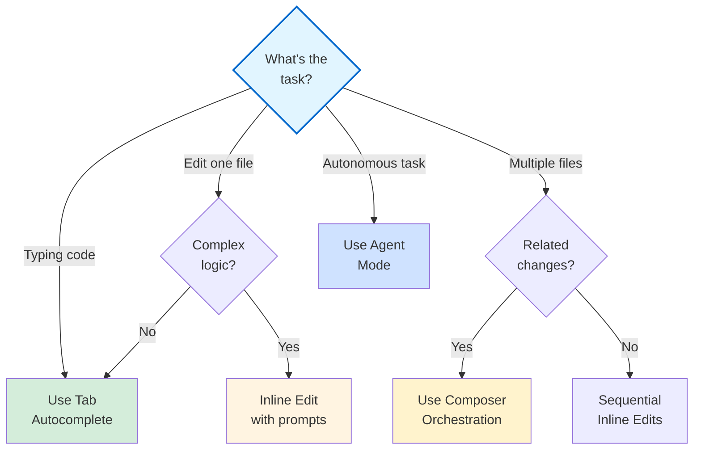
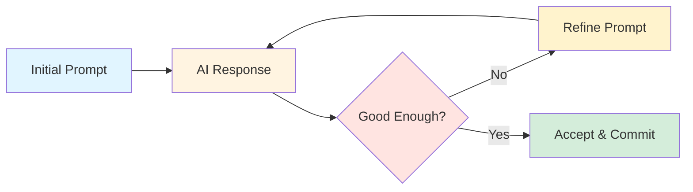

# Section 2: Advanced Prompting Strategies

**Time to Complete:** 60 minutes  
**Prerequisites:** [Section 1: Context Management](./01-context-management.md)

---

## 📋 Overview

Advanced prompting strategies unlock Cursor's full potential. Learn to orchestrate multiple tools, leverage different AI models strategically, and craft prompts that produce production-ready code consistently.

**What you'll learn:**
- Chain-of-thought prompting for complex problems
- Multi-tool orchestration (Tab, Inline Edit, Composer, Agent)
- Model ensemble strategy (Claude, GPT, Gemini, Cursor Composer)
- Context-faithful prompting techniques
- Structured prompting with examples
- Iterative refinement strategies
- Anti-patterns and how to avoid them

---

## 🧠 Chain-of-Thought Prompting

### What is Chain-of-Thought?

Chain-of-thought (CoT) prompting breaks complex problems into explicit reasoning steps. Instead of asking for the solution directly, you guide the AI through a logical progression.

**Traditional prompt:**
```
❌ "Build a user authentication system"
```

**Chain-of-thought prompt:**
```
✅ "Build a user authentication system. Let's approach this step by step:

Step 1: Analyze the existing codebase
- What authentication patterns already exist?
- What libraries are we using?
- What's in our instructions.md?

Step 2: Design the architecture
- Where will we store user credentials?
- How will we handle sessions?
- What routes need protection?

Step 3: Implement incrementally
- User registration
- Login/logout
- Protected routes
- Session management

Please start with Step 1: analyze @codebase and @instructions.md"
```

### Why Chain-of-Thought Works

| Approach | Success Rate | Code Quality | Debugging Time |
|----------|--------------|--------------|----------------|
| Direct request | 40-60% | Medium | High |
| **Chain-of-thought** | **80-95%** | **High** | **Low** |

**Benefits:**
- Reduces errors by forcing logical progression
- Creates checkpoints for validation
- Makes debugging easier (know which step failed)
- Produces more maintainable code
- Allows course correction mid-task

---

### Chain-of-Thought Patterns

#### Pattern 1: Analysis → Design → Implementation

```
"@codebase @instructions.md I need to add real-time notifications 
to our app. Let's break this down:

STEP 1 - ANALYSIS (Do this first):
- What is our current notification system (if any)?
- What tech stack are we using for real-time features?
- What are our scaling requirements?

STEP 2 - DESIGN (After analysis):
- Propose 2-3 architectural approaches
- Consider WebSockets vs Server-Sent Events vs Polling
- Estimate implementation complexity for each

STEP 3 - IMPLEMENTATION (After approval):
- Set up WebSocket server
- Create client-side connection handler
- Implement notification queue
- Add UI components

Please start with STEP 1 and wait for my approval before 
proceeding to STEP 2."
```

**Key points:**
- Explicit steps
- Gated progression (wait for approval)
- Clear deliverables at each step

---

#### Pattern 2: Hypothesis → Test → Fix

For debugging:

```
"@src/api/checkout.ts @tests/checkout.test.ts 

The checkout process fails intermittently (30% of the time).

STEP 1 - HYPOTHESES:
List 3-5 possible causes based on code analysis:
- Race condition?
- Database connection timeout?
- Payment provider API issue?
- Missing error handling?

STEP 2 - TESTING:
For each hypothesis, describe how to test it:
- What instrumentation to add?
- What logs to examine?
- What tests to run?

STEP 3 - FIX:
Once we identify the cause, implement the fix with:
- Proper error handling
- Additional logging
- Updated tests

Start with STEP 1: analyze the code and list hypotheses."
```

---

#### Pattern 3: Example → Pattern → Implementation

For consistency:

```
"@src/api/users.ts @src/api/products.ts 

STEP 1 - PATTERN EXTRACTION:
Analyze users.ts and products.ts to identify:
- Common authentication pattern
- Standard error handling approach
- Response format conventions
- Validation patterns

STEP 2 - DOCUMENTATION:
Document the extracted pattern in a way I can reuse

STEP 3 - IMPLEMENTATION:
Create @src/api/orders.ts following the exact same pattern

Start with STEP 1."
```

---

### CoT Best Practices

✅ **Do:**
- Number your steps clearly (STEP 1, STEP 2, etc.)
- Wait for validation between critical steps
- Include acceptance criteria for each step
- Make steps granular (30 min or less each)
- Allow for iteration within steps

❌ **Don't:**
- Make steps too large (harder to debug)
- Skip the analysis phase
- Proceed without validation on critical paths
- Mix unrelated concerns in one step
- Assume the AI "remembers" previous steps without context

---

### Chain-of-Thought Examples

#### Example 1: Database Migration

```
"@prisma/schema.prisma @src/lib/db.ts 

I need to add a many-to-many relationship between Users and Teams.

STEP 1 - SCHEMA DESIGN:
- Analyze current User and Team models
- Design the join table structure
- Consider any additional fields needed (role, joinedAt, etc.)
- Propose the Prisma schema changes

STEP 2 - MIGRATION PLAN:
- Create migration script
- Consider data migration for existing users/teams
- Plan rollback strategy
- Identify potential breaking changes

STEP 3 - CODE UPDATES:
- Update User and Team models with relations
- Add helper functions for team membership
- Update affected API routes
- Add validation

STEP 4 - TESTING:
- Write tests for new relationships
- Test migration on copy of production data
- Test rollback procedure

Start with STEP 1. Show me the proposed schema changes."
```

---

#### Example 2: Performance Optimization

```
"@src/components/Dashboard.tsx 

The Dashboard component is slow (3-5 second load time).

STEP 1 - MEASUREMENT:
- Profile the component with React DevTools
- Identify expensive renders
- Check for unnecessary re-renders
- Measure network requests

STEP 2 - ANALYSIS:
Based on measurements, identify top 3 bottlenecks:
- What's causing re-renders?
- Are we fetching too much data?
- Is there heavy computation?

STEP 3 - OPTIMIZATION PLAN:
For each bottleneck, propose solution:
- Memoization (useMemo, React.memo)?
- Code splitting?
- Data fetching optimization?
- Lazy loading?

STEP 4 - IMPLEMENTATION:
Implement the highest-impact optimizations first
Measure again to verify improvement

Start with STEP 1: profile and analyze the component."
```

---

## 🎻 Multi-Tool Orchestration

### The Cursor Toolkit

Cursor provides multiple tools, each optimized for different tasks:

| Tool | Speed | Scope | Best For |
|------|-------|-------|----------|
| **Tab** | ⚡⚡⚡ | Single line | Autocomplete, boilerplate |
| **Inline Edit** | ⚡⚡ | Single file | Focused edits, refactors |
| **Composer** | ⚡ | Multi-file | Features, coordination |
| **Agent** | ⚡ | Full project | Complex, autonomous tasks |

**Key insight**: Use the fastest tool that can accomplish your task.

---

### Multi-Tool Workflow Patterns

#### Pattern 1: Composer → Inline Edit → Tab

**Use case:** Building a new feature

```
PHASE 1 - Composer (Architecture)
"@codebase @instructions.md 

Create a comment system for blog posts with:
- Comment model (Prisma)
- API routes (CRUD)
- React components
- Form validation

Plan the architecture and create the files."

↓ Composer creates structure and initial implementation

PHASE 2 - Inline Edit (Refinement)
Open each file, press Cmd+K:
"Add proper error handling following our pattern in @src/lib/errors.ts"
"Add loading states and optimistic updates"

↓ Inline Edit refines each file

PHASE 3 - Tab (Polish)
As you write:
- Tab completes imports
- Tab suggests prop types
- Tab fills in common patterns
```

**Why this works:**
- Composer handles the coordination
- Inline Edit adds project-specific details
- Tab accelerates the typing

---

#### Pattern 2: Agent → Composer → Verify

**Use case:** Complex refactor

```
PHASE 1 - Agent (Discovery)
"@codebase Analyze how we're currently handling form validation. 
Find all instances and summarize the approaches."

↓ Agent searches and summarizes

PHASE 2 - Composer (Plan)
"@src/forms/ @src/components/ 

Based on the analysis, create a migration plan to consolidate 
all form validation using Zod. Show me:
1. What files need updating
2. What new utilities to create
3. Step-by-step migration order"

↓ Composer creates the plan

PHASE 3 - Inline Edit (Execute)
For each file:
"@src/forms/LoginForm.tsx @src/lib/validation.ts 
Update this form to use Zod validation"

↓ Manual verification after each step
```

---

#### Pattern 3: Tab → Inline Edit → Agent

**Use case:** Iterative development

```
PHASE 1 - Tab (Write)
Start coding a new component, let Tab suggest:
- Imports
- Props interface
- Basic structure
- Common patterns

↓ You write ~70%, Tab suggests ~30%

PHASE 2 - Inline Edit (Refine)
Select function, Cmd+K:
"Add TypeScript types"
"Add error handling"
"Extract this logic to a hook"

↓ Refine each piece

PHASE 3 - Agent (Test)
"@src/components/NewComponent.tsx 
Create comprehensive tests covering:
- Happy path
- Error cases
- Edge cases
- Integration with @src/hooks/useData.ts"

↓ Agent writes full test suite
```

---

### Tool Selection Decision Tree



---

### Multi-Tool Best Practices

#### 1. Start Fast, Then Slow Down

```
Fast (Tab): Write basic structure
Medium (Inline Edit): Add specifics
Slow (Composer): Coordinate complexity
Slowest (Agent): Autonomous exploration
```

**Example:**
```typescript
// PHASE 1: Tab completes this in seconds
import { useState } from 'react';

export function UserForm() {
  const [email, setEmail] = useState('');
  // Tab suggests state variables

// PHASE 2: Inline Edit adds validation (Cmd+K)
// "Add Zod validation for email format"

// PHASE 3: Composer coordinates
// "Add this form to @src/pages/signup.tsx and connect to 
// the API at @src/api/users.ts"
```

---

#### 2. Compose in Layers

```
Layer 1: Architecture (Composer/Agent)
  ↓ Creates files, structure, interfaces
  
Layer 2: Implementation (Composer/Inline Edit)
  ↓ Fills in logic, connects pieces
  
Layer 3: Refinement (Inline Edit/Tab)
  ↓ Polish, error handling, edge cases
  
Layer 4: Testing (Agent)
  ↓ Comprehensive test coverage
```

---

#### 3. Use the Right Tool for the Right Phase

| Phase | Tool | Example Task |
|-------|------|--------------|
| **Planning** | Composer/Agent | "Analyze and propose approach" |
| **Scaffolding** | Composer | "Create files and basic structure" |
| **Implementation** | Inline Edit + Tab | "Write the actual logic" |
| **Refactoring** | Inline Edit | "Extract to function, add types" |
| **Testing** | Agent | "Generate comprehensive tests" |
| **Documentation** | Agent | "Document all public APIs" |

---

## 🎭 Model Ensemble Strategy

### Understanding Model Strengths

Different AI models excel at different tasks. Use them strategically.

| Model | Context | Speed | Strengths | Best For |
|-------|---------|-------|-----------|----------|
| **Claude 4.5 Sonnet** | 200k | Medium | Deep reasoning, complex instructions | Architecture, refactoring |
| **Claude 4.5 Opus** | 200k | Slow | Highest quality, most capable | Critical code, algorithms |
| **GPT-5.2** | 128k | Fast | Speed, boilerplate | Quick tasks, iterations |
| **Gemini 3 Pro** | 1M | Medium | Massive context | Full codebase analysis |
| **Cursor Composer** | 200k | Fast | Multi-file coordination | Cross-file edits |

---

### Model Selection Strategy

#### When to Use Claude 4.5 Sonnet (Default)

**Strengths:**
- Deep reasoning and problem-solving
- Excellent code quality
- Strong architecture understanding
- Good context awareness

**Use for:**
- Complex refactoring
- Architecture decisions
- Algorithm implementation
- Critical business logic
- Debugging complex issues

**Example:**
```
[Model: Claude 4.5 Sonnet]

"@src/billing/ @instructions.md 

Design and implement a subscription billing system with:
- Multiple pricing tiers
- Proration logic
- Trial periods
- Dunning management
- Webhook handling for Stripe

This is critical business logic. Please analyze thoroughly 
and implement with comprehensive error handling."
```

---

#### When to Use GPT-5.2 (Speed)

**Strengths:**
- Fastest responses
- Good for boilerplate
- Quick iterations
- Standard patterns

**Use for:**
- CRUD operations
- Boilerplate generation
- Repetitive tasks
- Quick iterations
- Standard implementations

**Example:**
```
[Model: GPT-5.2]

"@src/api/users.ts 

Create standard CRUD endpoints for the Product model following 
the same pattern as users.ts. This is straightforward boilerplate."
```

---

#### When to Use Gemini 3 Pro (Massive Context)

**Strengths:**
- 1M token context window
- Full codebase analysis
- Pattern discovery across large codebases
- Architectural overview

**Use for:**
- Analyzing large monorepos
- Finding patterns across entire codebase
- Architectural reviews
- Large-scale refactoring planning
- Dependency analysis

**Example:**
```
[Model: Gemini 3 Pro]

"@codebase 

Analyze our entire codebase and:
1. Identify all database query patterns
2. Find inconsistencies in error handling
3. Map out authentication flow across all layers
4. Suggest architectural improvements

This requires understanding the full context of our 500-file codebase."
```

---

#### When to Use Cursor Composer (Multi-File)

**Strengths:**
- Optimized for multi-file edits
- Fast coordination
- 4x faster than general models
- Purpose-built for coding

**Use for:**
- Features spanning multiple files
- Consistent changes across files
- Coordinated refactoring
- File creation and orchestration

**Example:**
```
[Model: Cursor Composer]

"@src/components/ @src/hooks/ @src/api/ 

Add real-time updates to the dashboard:
1. Create WebSocket hook in hooks/
2. Update Dashboard component to use the hook
3. Add server endpoint in api/
4. Update types in types/

This requires coordinating changes across 4-5 files."
```

---

### Model Ensemble Patterns

#### Pattern 1: Planning → Execution → Review

```
PHASE 1: Claude 4.5 Sonnet (Planning)
"Analyze the problem and create a detailed implementation plan"

↓ Get high-quality architectural plan

PHASE 2: Cursor Composer (Execution)
"Implement the plan across these files [list files]"

↓ Fast multi-file implementation

PHASE 3: Claude 4.5 Sonnet (Review)
"Review the implementation for edge cases and errors"

↓ High-quality validation
```

---

#### Pattern 2: Discovery → Implementation

```
PHASE 1: Gemini 3 Pro (Discovery)
"@codebase Find all places where we handle user authentication"

↓ Complete map of authentication

PHASE 2: GPT-5.2 (Implementation)
"Update these 10 files to use the new auth pattern"

↓ Fast bulk updates
```

---

#### Pattern 3: Complex → Simple → Polish

```
PHASE 1: Claude 4.5 Opus (Complex Logic)
"Implement the complex pricing calculation algorithm"

↓ High-quality core logic

PHASE 2: GPT-5.2 (Boilerplate)
"Add API endpoints to expose this calculation"

↓ Fast boilerplate

PHASE 3: Claude 4.5 Sonnet (Polish)
"Add comprehensive error handling and edge case coverage"

↓ Production-ready code
```

---

### Model Switching Tips

**How to switch models in Cursor:**
1. Open Settings → Models
2. Select model for different contexts:
   - Chat model
   - Composer model
   - Inline Edit model
   - Tab autocomplete model

**Strategic defaults:**
```
Chat: Claude 4.5 Sonnet (best reasoning)
Composer: Cursor Composer (optimized for multi-file)
Inline Edit: GPT-5.2 (speed for small edits)
Tab: Cursor Tab (fastest autocomplete)
```

**When to override:**
- Critical business logic → Claude 4.5 Opus
- Large codebase analysis → Gemini 3 Pro
- Simple CRUD → GPT-5.2
- Complex refactor → Claude 4.5 Sonnet

---

## 🎯 Context-Faithful Prompting

### What is Context-Faithful Prompting?

Context-faithful prompting ensures the AI relies on **provided context** rather than **parametric knowledge** (training data).

**Problem:** AI might use outdated patterns or generic solutions instead of your project's specific patterns.

**Solution:** Explicitly direct AI to use provided context.

---

### Context-Faithful Techniques

#### Technique 1: Explicit References

```
❌ "Add authentication to the API"
   → AI uses generic auth pattern

✅ "@src/api/users.ts @src/middleware/auth.ts 

Add authentication to the products API using the EXACT same 
pattern from users.ts. Use the auth middleware from auth.ts. 
Do not deviate from this pattern."
```

**Key phrases:**
- "Using the EXACT same pattern"
- "Following the structure in..."
- "Matching the approach from..."
- "Consistent with..."

---

#### Technique 2: Pattern Isolation

```
"@src/api/users.ts @src/api/products.ts 

STEP 1: Extract the common pattern from users.ts and products.ts
STEP 2: Document the pattern explicitly
STEP 3: Apply the SAME pattern to create orders.ts

Do NOT use generic REST API patterns. Use OUR patterns only."
```

---

#### Technique 3: Negative Examples

```
"@src/components/UserCard.tsx 

Create ProductCard component following the pattern in UserCard.

IMPORTANT - Our conventions:
✅ Use Tailwind for styling (no CSS modules)
✅ Use SWR for data fetching (no useEffect)
✅ Use our Button component (no native <button>)

❌ DO NOT use:
- CSS modules or styled-components
- useEffect for data fetching
- Native HTML elements without our wrappers"
```

---

#### Technique 4: Forced Comparison

```
"@src/old/DeprecatedAuth.ts @src/new/ModernAuth.ts 

We're migrating from the old auth pattern to the new one.

STEP 1: Compare the two files and document the differences
STEP 2: Update @src/api/products.ts to use the NEW pattern
STEP 3: Verify it matches ModernAuth.ts, not DeprecatedAuth.ts

Include a checklist of changes to verify context-faithful migration."
```

---

### Context-Faithful Examples

#### Example 1: Refactoring

```
"@src/components/legacy/OldForm.tsx 
@src/components/modern/NewForm.tsx 

Refactor OldForm to match NewForm's architecture:

Context-faithful requirements:
1. Use the EXACT same hook structure from NewForm
2. Match the error handling pattern precisely
3. Copy the validation approach (Zod schemas)
4. Use the same UI component library calls

After refactoring, list 5 specific similarities that prove 
you followed NewForm's pattern."
```

---

#### Example 2: API Development

```
"@src/api/users.ts @src/lib/db.ts @src/lib/errors.ts 

Create @src/api/teams.ts with CRUD endpoints.

Context requirements:
1. Database access: ONLY through functions in db.ts
2. Error handling: ONLY using errors from errors.ts
3. Route structure: EXACTLY like users.ts
4. Response format: IDENTICAL to users.ts responses

Do NOT use any external patterns. Use only what's in the 
provided context files."
```

---

## 📝 Structured Prompting

### What is Structured Prompting?

Structured prompting uses **explicit format and examples** to guide AI output.

**Benefits:**
- More consistent output
- Easier to parse and validate
- Reduces need for clarification
- Scales to complex tasks

---

### Structured Prompt Templates

#### Template 1: Feature Request

```
FEATURE: [Feature name]

CONTEXT:
- Files: @file1.ts @file2.ts
- Related: @folder/
- Docs: @instructions.md

REQUIREMENTS:
1. [Functional requirement 1]
2. [Functional requirement 2]
3. [Non-functional requirement]

SUCCESS CRITERIA:
- [ ] [Testable criterion 1]
- [ ] [Testable criterion 2]
- [ ] [Testable criterion 3]

CONSTRAINTS:
- Must use [technology/pattern]
- Must not break [existing feature]
- Must follow [style guide]

OUTPUT FORMAT:
- Code changes with explanations
- Test cases
- Migration notes if needed
```

**Example:**
```
FEATURE: User Profile Editing

CONTEXT:
- Files: @src/components/UserProfile.tsx @src/api/users.ts
- Related: @src/hooks/
- Docs: @instructions.md

REQUIREMENTS:
1. Allow users to edit name, email, bio
2. Validate email format before saving
3. Show loading state during save
4. Display success/error messages

SUCCESS CRITERIA:
- [ ] Form validates before submission
- [ ] API updates user in database
- [ ] UI shows feedback to user
- [ ] Changes persist after page reload

CONSTRAINTS:
- Must use Zod for validation
- Must use our existing Form component
- Must follow error handling pattern in instructions.md

OUTPUT FORMAT:
- Updated UserProfile.tsx with edit mode
- Validation schema
- API integration
- Unit tests for validation
```

---

#### Template 2: Bug Fix

```
BUG REPORT: [Brief description]

AFFECTED FILE: @path/to/file.ts

REPRODUCTION:
1. [Step 1]
2. [Step 2]
3. [Observe error]

EXPECTED BEHAVIOR:
[What should happen]

ACTUAL BEHAVIOR:
[What actually happens]

ERROR DETAILS:
```
[Error message or log]
```

CONTEXT FILES:
@file1.ts (contains the bug)
@file2.ts (related functionality)
@test.test.ts (failing test)

INVESTIGATION REQUEST:
1. Identify root cause
2. Propose fix with explanation
3. List potential side effects
4. Suggest additional tests

FIX REQUIREMENTS:
- Must not break existing tests
- Must add regression test
- Must include error handling
```

---

#### Template 3: Code Review

```
REVIEW REQUEST: @path/to/file.ts

REVIEW CRITERIA:
1. [ ] Follows project conventions (@instructions.md)
2. [ ] Proper error handling
3. [ ] TypeScript types are correct
4. [ ] Test coverage is adequate
5. [ ] Performance considerations
6. [ ] Security considerations

SPECIFIC CONCERNS:
- [Concern 1]
- [Concern 2]

OUTPUT FORMAT:
For each criterion:
- ✅ PASS: [explanation] or
- ❌ FAIL: [issue] → [suggested fix]

SEVERITY:
- 🔴 Critical (must fix)
- 🟡 Important (should fix)
- 🟢 Minor (nice to have)
```

---

### Few-Shot Prompting

Provide 2-3 examples of desired output format.

```
"Create API error responses following these examples:

EXAMPLE 1 - Validation Error:
```typescript
{
  success: false,
  error: {
    code: 'VALIDATION_ERROR',
    message: 'Invalid input',
    details: [
      { field: 'email', message: 'Invalid email format' }
    ]
  }
}
```

EXAMPLE 2 - Not Found:
```typescript
{
  success: false,
  error: {
    code: 'NOT_FOUND',
    message: 'User not found',
    details: { userId: '123' }
  }
}
```

EXAMPLE 3 - Server Error:
```typescript
{
  success: false,
  error: {
    code: 'INTERNAL_ERROR',
    message: 'An unexpected error occurred',
    details: { requestId: 'abc-123' }
  }
}
```

Now, add proper error responses to @src/api/products.ts 
following this EXACT format."
```

---

## 🔄 Iterative Refinement

### The Refinement Loop



### Refinement Strategies

#### Strategy 1: Gradual Specification

Start broad, get specific iteratively.

```
ITERATION 1 (Broad):
"Add a search feature to the products page"

→ AI creates basic search

ITERATION 2 (More Specific):
"Update the search to include:
- Filter by category
- Price range slider
- Sort options"

→ AI adds filters

ITERATION 3 (Precise):
"Refine the filters:
- Category: multi-select dropdown
- Price: use our PriceRangeSlider component from @src/components/
- Sort: match the sort logic in @src/pages/OrdersPage.tsx"

→ AI implements precisely
```

---

#### Strategy 2: Feedback Incorporation

```
PROMPT 1:
"Create a user dashboard component"

→ AI creates basic dashboard

FEEDBACK:
"Good start, but:
1. Use our Card component instead of divs
2. Add loading skeletons
3. Make it responsive using our breakpoint system"

→ AI refines with feedback

FINAL REFINEMENT:
"Perfect, now add error boundaries and lazy loading for each card"

→ Production-ready component
```

---

#### Strategy 3: Diff-Based Refinement

```
INITIAL:
"@src/components/UserList.tsx Add pagination"

→ AI adds basic pagination

REFINEMENT (pointing to specific code):
"The pagination logic on lines 45-60 should:
1. Use our usePagination hook from @src/hooks/
2. Store page in URL query params (not state)
3. Match the style in @src/components/OrderList.tsx lines 30-40"

→ AI refines specific section
```

---

## 🚫 Anti-Patterns to Avoid

### Anti-Pattern 1: Vague Requests

```
❌ "Make this better"
❌ "Improve performance"
❌ "Fix the bugs"
❌ "Refactor this"
```

**Why bad:** No clear success criteria, no direction.

**Fix:**
```
✅ "Refactor this function to:
   1. Extract validation logic to @src/lib/validators.ts
   2. Use async/await instead of promises
   3. Add error handling using AppError
   4. Add JSDoc comments"
```

---

### Anti-Pattern 2: Assuming Context

```
❌ "Use the same pattern as before"
❌ "Following our standard approach"
❌ "Like we usually do"
```

**Why bad:** AI doesn't know what "before" or "usually" means.

**Fix:**
```
✅ "@src/api/users.ts Create products API following the 
   EXACT pattern from users.ts"
```

---

### Anti-Pattern 3: Multiple Unrelated Tasks

```
❌ "@codebase 
   1. Add dark mode
   2. Fix the login bug
   3. Refactor the database layer
   4. Update all dependencies
   5. Write documentation"
```

**Why bad:** No focus, poor quality on all tasks.

**Fix:** One task per conversation.
```
✅ Conversation 1: "@src/theme/ Add dark mode following our 
   theming system in @src/styles/"
   
✅ Conversation 2: "@src/auth/login.ts Fix the token expiration 
   bug where users are logged out prematurely"
```

---

### Anti-Pattern 4: No Validation Points

```
❌ "Build the entire authentication system in one go"
```

**Why bad:** No checkpoints, hard to debug if something goes wrong.

**Fix:**
```
✅ "Build authentication in phases:
   
   PHASE 1: User model and registration
   → Review and test before continuing
   
   PHASE 2: Login and JWT generation
   → Review and test before continuing
   
   PHASE 3: Protected routes middleware
   → Review and test before continuing"
```

---

### Anti-Pattern 5: Ignoring Errors

```
❌ [AI suggests code with TypeScript errors]
→ User accepts without checking
→ Code doesn't compile
```

**Why bad:** Compounds problems, wastes time.

**Fix:**
```
✅ Always check:
   - TypeScript errors (red squiggles)
   - Linter warnings
   - Test failures
   - Build errors
   
   If errors exist:
   "The code has TypeScript errors on lines 34 and 67. 
   Fix these by properly typing the user parameter and 
   the return value."
```

---

### Anti-Pattern 6: No Examples

```
❌ "Create components following our design system"
```

**Why bad:** AI doesn't know your design system.

**Fix:**
```
✅ "@src/components/Button.tsx @src/components/Card.tsx 
   Create a Modal component following the same patterns:
   - Same prop structure as Button
   - Same styling approach as Card
   - Use our design tokens from @src/styles/tokens.ts"
```

---

## 💡 Practical Examples

### Example 1: Complex Feature with CoT

```
"@codebase @instructions.md 

TASK: Implement shopping cart with persistence

STEP 1 - ARCHITECTURE ANALYSIS:
Please analyze our current state management and storage approach:
- What are we using for global state? (Redux, Zustand, Context?)
- How are we persisting data? (localStorage, IndexedDB, backend?)
- What patterns exist in @src/stores/ or @src/context/?

STEP 2 - DESIGN PROPOSAL:
Based on Step 1, propose:
- Cart state structure
- Storage strategy (local, backend, or hybrid)
- Component architecture
- API endpoints needed (if any)

Wait for my approval before Step 3.

STEP 3 - IMPLEMENTATION PHASE 1 (State):
- Create cart store/context
- Implement add/remove/update actions
- Add persistence layer
- Write tests

STEP 4 - IMPLEMENTATION PHASE 2 (UI):
- Create Cart component
- Add cart icon with item count
- Implement cart drawer/modal
- Add checkout button

STEP 5 - IMPLEMENTATION PHASE 3 (Integration):
- Connect to product pages
- Add cart validation
- Implement error handling
- Final testing

Start with STEP 1."
```

---

### Example 2: Multi-Tool Orchestration

```
TASK: Add user profile editing feature

PHASE 1 - Composer (Structure):
"@src/components/ @src/api/ @src/hooks/ @instructions.md

Create the basic structure for user profile editing:
1. UserProfileEdit component
2. useUserProfile hook for data fetching
3. PATCH /api/users/:id endpoint
4. Zod validation schema

Create empty shells with proper TypeScript types."

↓ [Composer creates files and structure]

PHASE 2 - Inline Edit (Implementation):
Open UserProfileEdit.tsx, press Cmd+K:
"Implement the form following the pattern in 
@src/components/AccountSettings.tsx. Use react-hook-form 
and our Form components from @src/components/ui/"

↓ [Inline Edit implements component]

PHASE 3 - Inline Edit (API):
Open api/users/[id].ts, press Cmd+K:
"Implement the PATCH endpoint following the pattern in 
@src/api/posts/[id].ts. Use Prisma to update the database 
and include proper error handling."

↓ [Inline Edit implements endpoint]

PHASE 4 - Agent (Testing):
"@src/components/UserProfileEdit.tsx 
@src/api/users/[id].ts 
@tests/

Create comprehensive tests:
- Unit tests for component (React Testing Library)
- Unit tests for validation schema
- Integration tests for API endpoint
- E2E test for the full edit flow"

↓ [Agent creates full test suite]
```

---

### Example 3: Model Ensemble Strategy

```
TASK: Optimize slow dashboard page

PHASE 1 - Gemini 3 Pro (Analysis):
"@codebase @src/pages/Dashboard.tsx 

Analyze the Dashboard page and all its dependencies 
across the entire codebase:
1. What data is it fetching? (find all API calls)
2. What components is it rendering? (find all imports recursively)
3. What are the performance bottlenecks?
4. Where are unnecessary re-renders happening?

I need the full picture across our 500+ file codebase."

↓ [Gemini analyzes entire codebase]

PHASE 2 - Claude 4.5 Sonnet (Strategy):
"Based on the Gemini analysis, design an optimization strategy:
1. Prioritize optimizations by impact
2. Identify risks and tradeoffs
3. Create implementation plan with phases
4. Estimate complexity for each optimization"

↓ [Claude creates detailed strategy]

PHASE 3 - Cursor Composer (Implementation):
"@src/pages/Dashboard.tsx @src/components/DashboardWidget.tsx 
@src/hooks/useDashboardData.ts 

Implement Phase 1 optimizations:
- Add React.memo to widgets
- Implement data fetching with SWR
- Add skeleton loading states
- Extract expensive calculations to useMemo"

↓ [Composer implements across files]

PHASE 4 - GPT-5.2 (Testing):
"Create performance tests to verify improvements:
- Measure render time before/after
- Check for unnecessary re-renders
- Validate data fetching efficiency"

↓ [GPT-5 quickly generates performance tests]
```

---

## ✅ Advanced Prompting Checklist

Before crafting a complex prompt:

- [ ] **Broken into steps** - Using chain-of-thought for complex tasks
- [ ] **Right tool selected** - Using fastest tool that works
- [ ] **Right model chosen** - Using best model for the task type
- [ ] **Context provided** - Files, examples, patterns included
- [ ] **Success criteria defined** - Know what "done" looks like
- [ ] **Examples included** - Show desired format/pattern
- [ ] **Validation points** - Know when to review/approve
- [ ] **Single focused task** - Not mixing unrelated concerns

---

## 🎓 Advanced Prompting Mastery

### Beginner Level
- Use basic multi-step prompts
- Combine 2-3 tools in sequence
- Stick to default model (Claude 4.5 Sonnet)
- Iterate based on output

### Intermediate Level
- Apply chain-of-thought for complex tasks
- Orchestrate multiple tools strategically
- Switch models based on task type
- Use structured prompt templates
- Provide examples for consistency

### Advanced Level
- Master model ensemble patterns
- Create custom prompt templates
- Optimize tool selection for efficiency
- Apply context-faithful techniques consistently
- Build iterative refinement workflows
- Recognize and fix anti-patterns quickly

---

## 📚 Quick Reference

### Chain-of-Thought Template

```
STEP 1 - [ANALYSIS]:
[What to analyze]

STEP 2 - [DESIGN]:
[What to design]

STEP 3 - [IMPLEMENTATION]:
[What to implement]

STEP 4 - [VALIDATION]:
[How to validate]

Start with STEP 1.
```

### Model Selection Quick Guide

```
Claude 4.5 Sonnet:  Complex logic, architecture
GPT-5.2:           Speed, boilerplate
Gemini 3 Pro:      Full codebase analysis
Cursor Composer:   Multi-file coordination
```

### Tool Selection Quick Guide

```
Tab:           Typing, autocomplete
Inline Edit:   Single-file focus
Composer:      Multi-file features
Agent:         Autonomous tasks
```

---

## 🚀 Next Steps

You've mastered advanced prompting strategies! Now:

1. **Practice**: Apply chain-of-thought to your next complex task
2. **Experiment**: Try different model combinations
3. **Optimize**: Use the fastest tool for each job
4. **Refine**: Iterate on prompts until they're perfect
5. **Continue**: Move to [Part 5: Team Collaboration](../05-team-collaboration-domain/)

---

**Section Status:** ✅ Complete  
**Last Updated:** January 2026  
**Next Section:** [Part 5: Team Collaboration & Domain Patterns](../05-team-collaboration-domain/) →
