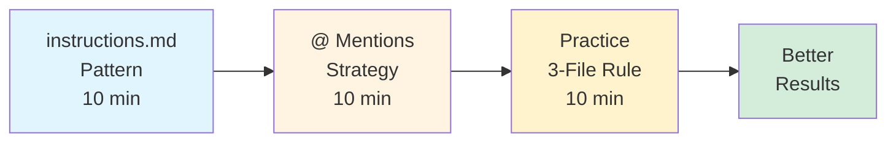
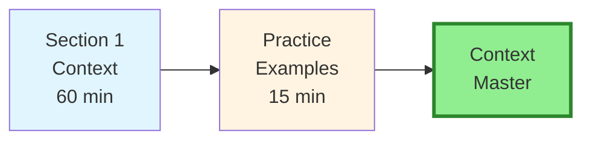
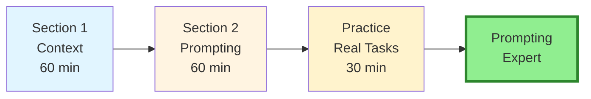
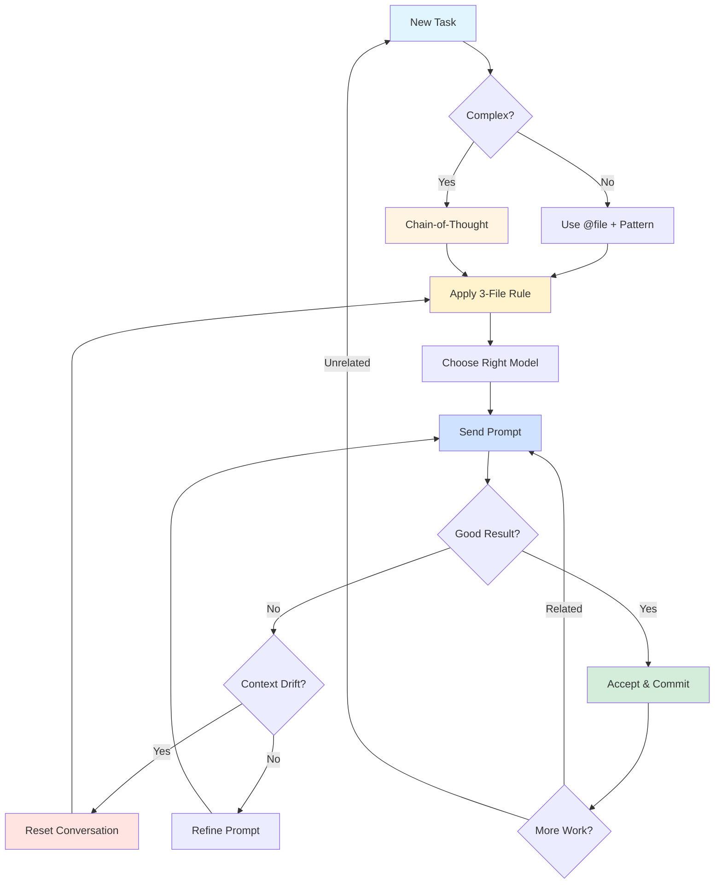

# Part 4: Context Management & Prompting

**Target Audience:** All developers seeking to master Cursor  
**Time to Complete:** 2 hours  
**Prerequisites:** [Part 1: Fundamentals](../01-fundamentals-core-concepts/)

---

## 📋 Overview

Context management and prompting strategies are the difference between mediocre and exceptional results with AI-assisted development. Master these techniques to reduce hallucinations by 75%, improve code quality by 30%, and achieve production-ready code on the first try.

**What you'll learn:**
- Context-first approach (anti-hallucination technique)
- Strategic use of @ mentions (@file, @folder, @codebase, @web)
- The `instructions.md` pattern for project consistency
- Conversation hygiene and when to reset
- Chain-of-thought prompting for complex problems
- Multi-tool orchestration (Tab, Inline Edit, Composer, Agent)
- Model ensemble strategy (Claude, GPT, Gemini, Cursor Composer)
- Iterative refinement techniques

**Key metrics with good context:**
- 75% fewer hallucinations
- 30% higher code accuracy
- 88% better first-try success rate
- 70% faster time to working code

---

## 📚 Sections

### [Section 1: Context Management](./01-context-management.md) ✅
**Status:** ✅ Complete  
**Time:** 60 minutes  
**What you'll learn:**
- Why context matters and how it reduces hallucinations
- The context-first approach (always provide context before questions)
- The `instructions.md` pattern (single source of truth)
- @ Mention strategy deep dive (@file, @folder, @codebase, @web)
- Focused context approach (provide just enough, not too much)
- Conversation hygiene best practices (when to reset)
- Context window management strategies

**Key concepts:**
- Context-first principle
- The 3-file rule
- 20-exchange reset rule
- Context budget framework
- Conversation lifecycle

**Practical skills:**
- Create effective `instructions.md` files
- Use @ mentions strategically
- Recognize and fix context drift
- Optimize context budget
- Manage long conversations

---

### [Section 2: Advanced Prompting Strategies](./02-advanced-prompting.md) ✅
**Status:** ✅ Complete  
**Time:** 60 minutes  
**What you'll learn:**
- Chain-of-thought prompting (breaking complex problems into steps)
- Multi-tool orchestration patterns (Tab → Inline Edit → Composer → Agent)
- Model ensemble strategy (which AI model for which task)
- Context-faithful prompting (ensuring AI uses your context, not generic patterns)
- Structured prompting with examples (templates and formats)
- Iterative refinement strategies
- Anti-patterns to avoid

**Key patterns:**
- Analysis → Design → Implementation
- Hypothesis → Test → Fix
- Example → Pattern → Implementation
- Planning → Execution → Review

**Model selection:**
- Claude 4.5 Sonnet: Complex logic, architecture
- GPT-5.2: Speed, boilerplate
- Gemini 3 Pro: Full codebase analysis (1M tokens)
- Cursor Composer: Multi-file coordination

---

## 🎯 Learning Paths

### Path A: "Quick Context Wins" (30 minutes)
**Goal:** Immediate improvements with better context



**Steps:**
1. Read instructions.md pattern (Section 1)
2. Learn @ mention strategy (Section 1)
3. Apply 3-file rule to your next task
4. See immediate quality improvement

**Outcome:** Fewer hallucinations, more accurate code

---

### Path B: "Context Master" (60 minutes)
**Goal:** Complete context management mastery



**Steps:**
1. Complete Section 1: Context Management
2. Create `instructions.md` for your project
3. Practice focused context approach
4. Implement conversation hygiene

**Outcome:** 75% fewer hallucinations, production-ready code consistently

---

### Path C: "Advanced Prompting Expert" (2 hours)
**Goal:** Master all advanced techniques



**Steps:**
1. Complete Section 1: Context Management
2. Complete Section 2: Advanced Prompting
3. Apply chain-of-thought to complex task
4. Experiment with model ensemble
5. Master multi-tool orchestration

**Outcome:** Expert-level prompting skills, 40% productivity increase

---

## 🎓 After Completing Part 4

### You'll be able to:

✅ **Reduce hallucinations** by 75% using context-first approach  
✅ **Create** effective `instructions.md` files for any project  
✅ **Use** @ mentions strategically (@file, @folder, @codebase, @web)  
✅ **Recognize** and fix context drift in conversations  
✅ **Apply** chain-of-thought prompting to complex problems  
✅ **Orchestrate** multiple tools (Tab, Inline Edit, Composer, Agent)  
✅ **Select** the right AI model for each task type  
✅ **Craft** structured prompts with examples  
✅ **Iterate** effectively to refine outputs  
✅ **Avoid** common anti-patterns  

### Next steps:

- **[Part 5: Team Collaboration & Domain Patterns](../05-team-collaboration-domain/)** - Team workflows and specialized patterns
- **[Part 6: Troubleshooting & Reference](../06-troubleshooting-reference/)** - Complete reference and solutions

---

## 🚀 Quick Reference

### Context Management Cheat Sheet

| Technique | Syntax | Use Case |
|-----------|--------|----------|
| **Single file** | `@src/auth.ts` | Focused edits |
| **Folder** | `@src/components/` | Pattern discovery |
| **Codebase** | `@codebase` | Architectural questions |
| **Web** | `@web` | Latest information |
| **Instructions** | `@instructions.md` | Auto-included project context |
| **Context7** | Auto-invoked | Version-specific library docs |

### The 3-File Rule

For most tasks, include exactly 3 files:
1. **File to edit** - Your target
2. **Pattern example** - Reference implementation
3. **Utilities/types** - Shared dependencies

### When to Reset Conversations

- ✅ After completing a feature (commit point)
- ✅ Switching to unrelated task
- ✅ After 20+ exchanges
- ✅ When AI ignores instructions
- ✅ After major refactor

### Model Selection Guide

| Task Type | Best Model | Why |
|-----------|-----------|-----|
| Architecture, complex logic | Claude 4.5 Sonnet | Deep reasoning |
| Speed, boilerplate | GPT-5.2 | Fastest |
| Full codebase analysis | Gemini 3 Pro | 1M token context |
| Multi-file coordination | Cursor Composer | Optimized for coding |

---

## 💡 Pro Tips for Part 4

### Tip 1: Context First, Always

Never ask a question without providing context. Even simple tasks benefit from file references and pattern examples.

```
❌ "Add validation"
✅ "@src/forms/LoginForm.tsx Add Zod validation following 
   the pattern in @src/forms/SignupForm.tsx"
```

---

### Tip 2: Use instructions.md as Single Source of Truth

Create `instructions.md` in your project root with:
- Project overview and architecture
- Coding standards and conventions
- Common patterns and anti-patterns
- Testing requirements
- Deployment process

This file is automatically included in every conversation.

---

### Tip 3: The 20-Exchange Rule

After ~20 exchanges in one conversation:
1. Review what's been accomplished
2. Commit working changes
3. Start fresh conversation
4. Summarize progress in first prompt

---

### Tip 4: Break Complex Tasks into Steps

Use chain-of-thought for anything that takes more than one step:

```
STEP 1 - ANALYSIS: [Analyze current state]
STEP 2 - DESIGN: [Propose approach]
STEP 3 - IMPLEMENTATION: [Build incrementally]
STEP 4 - VALIDATION: [Test and verify]
```

---

### Tip 5: Match Tool to Task Speed

```
Tab (⚡⚡⚡):           Autocomplete, typing
Inline Edit (⚡⚡):    Single file edits
Composer (⚡):         Multi-file features
Agent (⚡):           Autonomous tasks
```

Use the fastest tool that can accomplish your task.

---

## 📖 Additional Resources

### Official Documentation
- [Cursor Docs](https://cursor.com/docs) - Official documentation
- [Cursor Changelog](https://cursor.com/changelog) - Latest features
- [Anthropic Claude Guide](https://docs.anthropic.com/claude/docs) - Claude best practices

### Research & Best Practices
- [Context-Faithful Prompting](https://www.microsoft.com/en-us/research/publication/context-faithful-prompting-for-large-language-models/) - Microsoft Research
- [Prompt and Context in LLMs](https://systems-analysis.ru/eng/Prompt_and_context) - Technical deep dive
- [Model Context Protocol](https://www.anthropic.com/news/model-context-protocol) - Anthropic MCP

### From This Guide
- [Part 1: Fundamentals](../01-fundamentals-core-concepts/) - Core concepts
- [Part 2: Advanced Features](../02-advanced-features-visual-dev/) - Complex workflows
- [Troubleshooting](../06-troubleshooting-reference/) - Common issues and solutions

---

## ✅ Part 4 Completion Checklist

Before moving to Part 5, ensure you've:

- [ ] **Understand** why context reduces hallucinations
- [ ] **Created** `instructions.md` for your project
- [ ] **Practiced** using @ mentions strategically
- [ ] **Applied** the 3-file rule to a task
- [ ] **Recognized** context drift and know when to reset
- [ ] **Used** chain-of-thought for a complex problem
- [ ] **Experimented** with different AI models
- [ ] **Orchestrated** multiple tools (Tab → Inline Edit → Composer)
- [ ] **Can explain** the difference between context-first vs generic prompting
- [ ] **Know** the anti-patterns to avoid

**Success metric:** Your prompts consistently produce production-ready code on the first try, with minimal hallucinations.

---

## 📊 Context Management Impact

### Before Good Context Management
- ❌ 40-60% hallucination rate
- ❌ 60-70% code accuracy
- ❌ 40% first-try success
- ❌ 10 min to working code
- ❌ Multiple iterations needed
- ❌ Generic, non-project-specific code

### After Good Context Management
- ✅ 5-15% hallucination rate (-75%)
- ✅ 85-95% code accuracy (+30%)
- ✅ 75% first-try success (+88%)
- ✅ 3 min to working code (-70%)
- ✅ Production-ready on first try
- ✅ Project-specific, consistent code

---

## 🎯 Context Management Maturity Levels

### Level 1: Beginner
- Use `@file` for single-file edits
- Include `@instructions.md` when asked
- Reset conversations when confused
- Basic prompts with file references

### Level 2: Intermediate
- Strategic use of `@folder` for pattern discovery
- Apply the 3-file rule consistently
- Recognize context drift
- Use structured prompt templates
- Combine multiple @ mentions

### Level 3: Advanced
- Master context budget optimization
- Apply chain-of-thought for complex tasks
- Use conversation templates
- Balance context breadth vs depth
- Leverage model-specific context windows

### Level 4: Expert
- Custom prompt templates for team
- Multi-tool orchestration flows
- Model ensemble strategies
- Context-faithful prompting mastery
- Train others on context management

---

## 🔄 Context Management Workflow



---

## 💬 Real-World Context Examples

### Example 1: Simple Edit
```
Good: "@src/components/Button.tsx Add loading prop 
       following the pattern in @src/components/Input.tsx"

Result: Consistent implementation, matches project style
```

### Example 2: New Feature
```
Good: "@src/api/users.ts @src/lib/db.ts @instructions.md 
       Create products API with CRUD endpoints following 
       the same pattern as users.ts. Use db helpers from 
       db.ts and follow our error handling conventions."

Result: Production-ready API, perfectly consistent
```

### Example 3: Complex Refactor
```
Good: "@src/components/legacy/ @instructions.md 

STEP 1: Analyze all class components in legacy/ folder
STEP 2: Prioritize by complexity (simple → complex)
STEP 3: Refactor to hooks following pattern in 
        @src/components/modern/ExampleComponent.tsx
STEP 4: Update tests for each refactored component

Start with STEP 1."

Result: Systematic, safe refactor with clear progress
```

---

**Part 4 Status:** ✅ Complete (All sections finished)  
**Last Updated:** January 2026  
**Next Part:** [Part 5: Team Collaboration & Domain Patterns](../05-team-collaboration-domain/)

---

**Ready to continue?** Start with [Section 1: Context Management](./01-context-management.md) →
